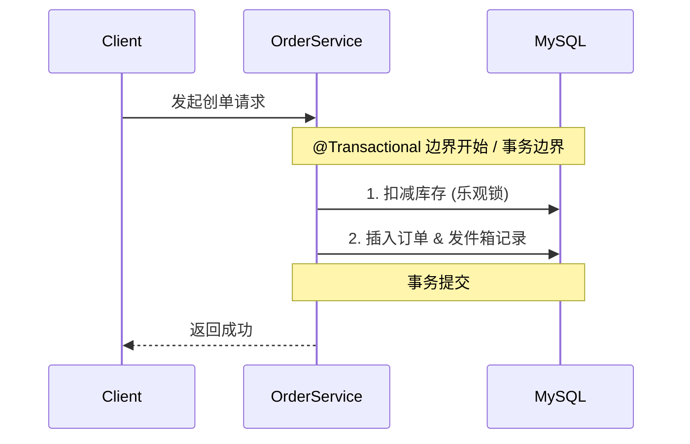

# RFC-[EpicID]-[序号]: [short verb phrase, e.g. implement-outbox-pattern]

##  Metadata

* **Epic:** [链接到具体的 EPIC-XXX.md]
* **Status:** DRAFT / NEED_CLARIFICATION / IN_DESIGN / IMPLEMENTING / COMPLETED / SUPERSEDED
* **Owner:** [人类开发者姓名 / qinric]
* **Created At:** [YYYY-MM-DD]

---

## 1. 背景与目标 (Context & Objective)
> **Filled by `requirement-analyst` during REQUIREMENT phase**

* **Summary:** 本次变更要解决什么具体问题？
  （例如：为了保证本地订单数据与下游票务系统的最终一致性，引入发件箱模式可靠投递消息）

* **Business Value:** 为什么现在要做这个？

---

## 2. 范围与边界 (Scope & Boundaries)

> **Filled by `requirement-analyst`**

* **✅ In-Scope:**
  [例如：订单落盘与本地消息表的事务一致性设计]

* **❌ Out-of-Scope:**
  [例如：暂不实现消费端的重试死信队列 (DLQ) 处理]

---

## 3. 模糊点与抉择矩阵 (Ambiguities & Decision Matrix)

> **Identified by `requirement-analyst`, resolved by human or `system-architect`**
> *If empty → proceed to design phase*

| ID | Ambiguity / Decision Point | Option A    | Option B      | Final Decision (ADR) |
| :- | :------------------------- | :---------- | :------------ | :------------------- |
| 1  | 防重放的时间窗口与策略未定义             | 5分钟内幂等返回旧结果 | 返回 HTTP 409   | [TBD]                |
| 2  | 高并发库存扣减策略                  | DB 乐观锁      | Redis Lua 预扣减 | [TBD / ADR-xxx]      |

---

## 4. 技术实现图纸 (Technical Design)

> **MUST NOT proceed unless Section 3 is fully resolved**

### 4.1 核心状态流转与交互 (Sequence & State)
> **Filled by `system-architect` during BEHAVIOR_DESIGN phase**
> **MUST include transaction boundary, RPC calls, and asynchronous triggers.**

---

### 4.2 接口契约变更 (API Contracts)
> **Filled by `system-architect` during BEHAVIOR_DESIGN phase**

* **Endpoint:** `POST /api/v1/orders`
* **Key Fields:** [列出新增或修改字段，例如 JSON Schema]
* **Backward Compatibility:** YES / NO

---

### 4.3 存储资产与数据模型 (Storage & Schema)
> **Filled by `database-engineer` during STORAGE_DESIGN phase**
> **Derived strictly from Sections 4.1 and 4.2**

* **Schema Check:** 已查阅 `schema-summary.md`
* **Migration Script:**
  `V1.2__create_outbox_table.sql`
* **Design Notes:**
  [字段设计说明：例如，根据图纸中的重试机制，增加 retry_count 字段]

---

## 5. 异常分支与容灾 (Edge Cases & Failure Modes)

> **Derived by `system-architect`, rigorously tested by `qa-agent` and implemented by `implementation-agent`**

### 5.1 Cache/Network Failure
* [例如：Redis 宕机 → fallback DB]
* [例如：防穿透策略（Bloom / 限流）]

### 5.2 Concurrency Conflict
* [例如：两人抢最后一张票 → 返回 SOLD_OUT / RETRY]

### 5.3 External Dependency Failure
* [例如：支付超时 → 状态 PENDING + 补偿机制]

## 6. 审计与遗留债务 (Audit & Tech Debt)

> **Filled by `human` or `reviewer-agent` during REVIEW phase**
> 仅记录被 `APPROVE` 放行的 WARNING 和 SUGGESTION，用于后续重构参考。已修复的 BLOCKER 无需记录。

| ID | 文件与行号 | 严重级别 | 问题描述 | 决议 / 修复计划 (ADR/Epic) |
| :- | :--- | :--- | :--- | :--- |
| 1 | `OrderService.java:120` | WARNING | 实际查询使用了 type 和 created_at 组合过滤，缺少联合索引 | 接受风险，将在 V1.3 版本补充 Flyway 脚本 |
