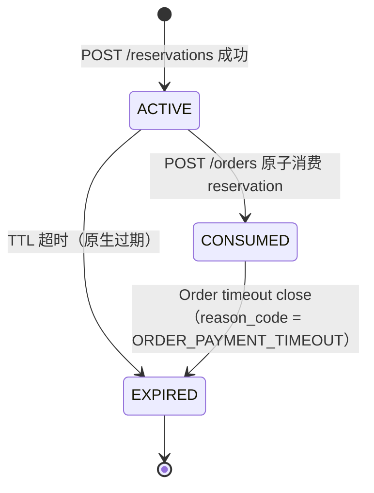
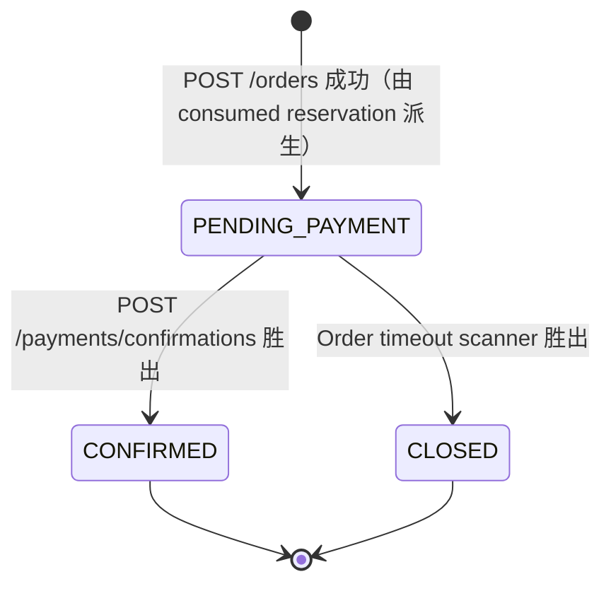
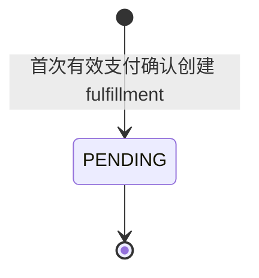
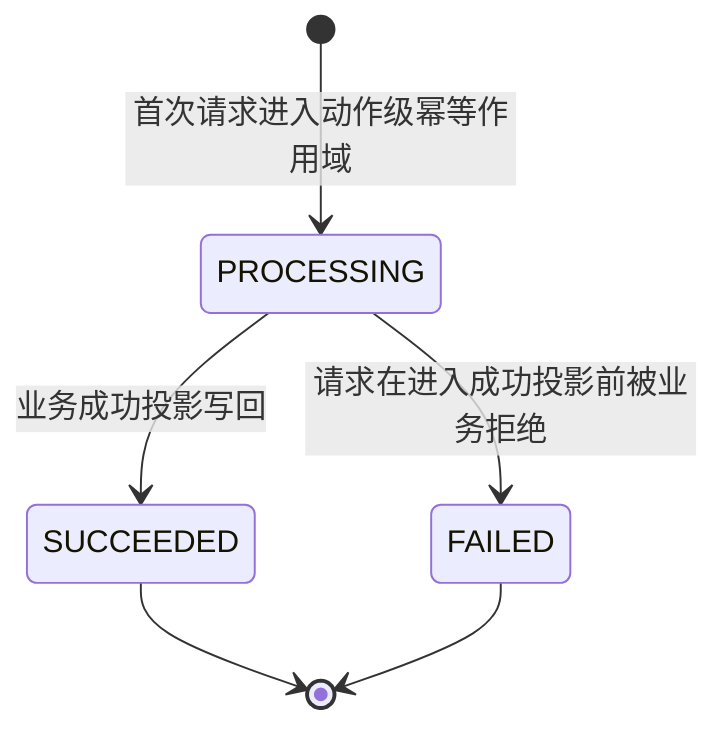

# Global State Machines

**Maintained by:** librarian
**Last updated by:** migration (from RFC-TKT001-01 / RFC-TKT001-02 / RFC-TKT001-03)
**Scope:** 当前 Phase 1 已冻结的跨聚合状态机 + 并发裁决规则。

此文件是全局状态机的唯一事实。任何改动必须由 feat 的 Architect Stage 产出变更提案，经 Reviewer 批准后再同步到这里。

---

## 1. Reservation State Machine

**Transition ownership**

| Transition | 触发方 | 事务边界 | 乐观锁守护 | 审计事件 |
|:--|:--|:--|:--|:--|
| `ACTIVE → CONSUMED` | Order Module（POST /orders） | T1 ReservationConsume+OrderCreate | `reservation_record.version`（ACTIVE → CONSUMED 原子） | `RESERVATION_CONSUMED` |
| `ACTIVE → EXPIRED` | 原生 TTL 到期（暂未在 Phase 1 冻结扫描路径） | — | — | `RESERVATION_RELEASED` |
| `CONSUMED → EXPIRED` | Order Module（Timeout Sweep） | T3 Order timeout close | 与 Order `PENDING_PAYMENT → CLOSED` 同一事务 | `RESERVATION_RELEASED`（reason_code = ORDER_PAYMENT_TIMEOUT） |

**关键不变量**

* 不引入新的 `RELEASED` 状态；原生 TTL 与 `ORDER_PAYMENT_TIMEOUT` 统一收敛为 `EXPIRED`，原因由 `AuditTrailEvent.reason_code` 区分。
* `ACTIVE → CONSUMED` 必须与 Order 创建同事务完成；不允许出现 `reservation=CONSUMED` 但 `order` 不存在的部分提交。
* `CONSUMED → EXPIRED` 必须与 `Order.CLOSED` 同事务完成；不允许裸释放。

---

## 2. TicketOrder State Machine

**Transition ownership**

| Transition | 触发方 | 事务边界 | 乐观锁守护 | 审计事件 |
|:--|:--|:--|:--|:--|
| `[*] → PENDING_PAYMENT` | Order Module（POST /orders） | T1 ReservationConsume+OrderCreate | — | `ORDER_CREATED` |
| `PENDING_PAYMENT → CONFIRMED` | Payment Confirmation Module | T2 PaymentConfirmation | `ticket_order.version` CAS | `ORDER_CONFIRMED` |
| `PENDING_PAYMENT → CLOSED` | Order Module（Timeout Sweep） | T3 Order timeout close | `ticket_order.version` CAS | `ORDER_TIMEOUT_CLOSED` |

**关键不变量**

* `CONFIRMED` 与 `CLOSED` 互斥且终态；一旦到达，任何反向/跨态迁移均禁止。
* 只有 `status = PENDING_PAYMENT && payment_deadline_at <= now` 才能进入关闭提交；扫描层允许重复发现，执行层必须幂等。
* `PENDING_PAYMENT → CONFIRMED` 与 `PENDING_PAYMENT → CLOSED` 的裁决由 `ticket_order.version` CAS 唯一仲裁（见 §6 并发裁决）。

---

## 3. Fulfillment State Machine

**Transition ownership**

| Transition | 触发方 | 事务边界 | 物理约束 | 审计事件 |
|:--|:--|:--|:--|:--|
| `[*] → PENDING` | Payment Confirmation Module | T2 PaymentConfirmation | `uk_fulfillment_record_order_id`（每个 Order 只能一条） | `FULFILLMENT_CREATED` |

**关键不变量**

* Phase 1 暂冻结在 `PENDING`；后续履约执行的状态扩展由新 feat 接管，本文件届时追加新迁移。
* 一个 `Order.CONFIRMED` 必须且只能对应一条 `Fulfillment.PENDING`。该不变量同时由业务规则与 `uk_fulfillment_record_order_id` 物理约束双保险。

---

## 4. IdempotencyRecord State Machine

**Transition ownership**

| Transition | 触发方 | 备注 |
|:--|:--|:--|
| `[*] → PROCESSING` | 任意业务入口（CREATE_RESERVATION / CREATE_ORDER / PAYMENT_CONFIRMATION） | 插入受 `uk(action_name, idempotency_key)` 物理保护 |
| `PROCESSING → SUCCEEDED` | 业务事务提交后写回 `response_payload` | 同次请求再到达时直接回放 |
| `PROCESSING → FAILED` | 业务校验拒绝（例如 reservation 已 CONSUMED） | 同 key 再到达需按当前业务快照重新判定 |

**关键不变量**

* 幂等作用域按 `action_name` 隔离：`CREATE_RESERVATION`、`CREATE_ORDER`、`PAYMENT_CONFIRMATION` 互不共享幂等空间。
* 同 key 再到达时：`SUCCEEDED` 直接回放 `response_payload`；`PROCESSING` 返回 *_IN_PROGRESS（retryable）；不同 `request_hash` 返回 `IDEMPOTENCY_CONFLICT`。

---

## 5. CatalogItem / InventoryResource（静态生命周期）

当前 Phase 1 只冻结 `status` 语义，不存在动作驱动的状态迁移。

* `CatalogItem.status`：`DRAFT` / `ACTIVE` / `OFF_SHELF`；只有 `ACTIVE` 可进入售卖。
* `InventoryResource.status`：`ACTIVE` / `FROZEN` / `OFFLINE`；`reserved_quantity` 由 Reservation / 回补动作调整，受 `version` 乐观锁保护。

---

## 6. 并发裁决规则（Payment vs Timeout）

同一 `TicketOrder.PENDING_PAYMENT` 可能同时被「Payment Confirmation」与「Timeout Sweep」竞争。裁决规则：

1. 两条路径都使用 `ticket_order.version` CAS：`UPDATE ticket_order SET status=?, version=version+1 WHERE order_id=? AND status='PENDING_PAYMENT' AND version=?`。
2. **胜者**完成业务事务（见 §7 对应事务）并 append 成功审计事件。
3. **败者**一定读到 `status ∈ {CONFIRMED, CLOSED}` 或 `version` 失配，必须返回稳定业务错误：
   * Payment 失败：`ORDER_NOT_CONFIRMABLE`，并 append `PAYMENT_CONFIRMATION_REJECTED`。
   * Timeout 失败：静默跳过该候选，等待下一轮扫描（目标已落终态，无需 append 拒绝事件）。
4. 败者**不允许**尝试 reopen、不允许重建 Fulfillment、不允许恢复 Reservation。

---

## 7. 跨聚合事务边界索引

| 事务 ID | 触发动作 | 覆盖写 | 冲突守护 | 详见 |
|:--|:--|:--|:--|:--|
| T1 | POST /orders | `reservation_record`（ACTIVE→CONSUMED）+ `ticket_order`（insert）+ `idempotency_record` | `reservation.version` CAS + `uk_ticket_order_reservation_id` | `domain_models.md §4.1` |
| T2 | POST /payments/confirmations | `ticket_order`（PENDING_PAYMENT→CONFIRMED）+ `fulfillment_record`（insert）+ `audit_trail_event` + `idempotency_record` | `ticket_order.version` CAS + `uk_fulfillment_record_order_id` | `domain_models.md §4.2` |
| T3 | Order Timeout Sweep | `ticket_order`（PENDING_PAYMENT→CLOSED）+ `reservation_record`（CONSUMED→EXPIRED）+ `inventory_resource`（restore reserved_quantity）+ `audit_trail_event` | `ticket_order.version` CAS + `reservation.version` CAS + `inventory.version` CAS | `domain_models.md §4.3` |

**跨事务统一约束**

* 所有事务运行在 `READ_COMMITTED` 隔离级别 + 乐观锁 CAS；不使用悲观行锁或 `SELECT FOR UPDATE`。
* Audit append 必须与业务主状态同事务提交；不接受「主状态成功、审计缺失」。
* 事务失败必须整体回滚，由上层重试或下一轮扫描复检，禁止半提交补偿。

---

## 8. Provenance

| 状态机 | 首次冻结 | 后续扩展 |
|:--|:--|:--|
| Reservation（ACTIVE / CONSUMED / EXPIRED） | `feat-TKT001-01` | `feat-TKT001-03` 增加 `CONSUMED → EXPIRED` |
| TicketOrder（PENDING_PAYMENT / CONFIRMED / CLOSED） | `feat-TKT001-01` 冻结 `PENDING_PAYMENT`；`feat-TKT001-02` 引入 `CONFIRMED` | `feat-TKT001-03` 引入 `CLOSED` |
| Fulfillment（PENDING） | `feat-TKT001-02` | — |
| IdempotencyRecord（PROCESSING / SUCCEEDED / FAILED） | `feat-TKT001-01` | `feat-TKT001-02` 将 PAYMENT_CONFIRMATION 纳入幂等作用域 |
| Payment vs Timeout 裁决 | `feat-TKT001-03` | — |
