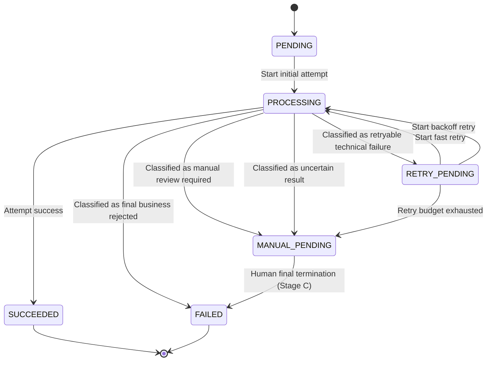
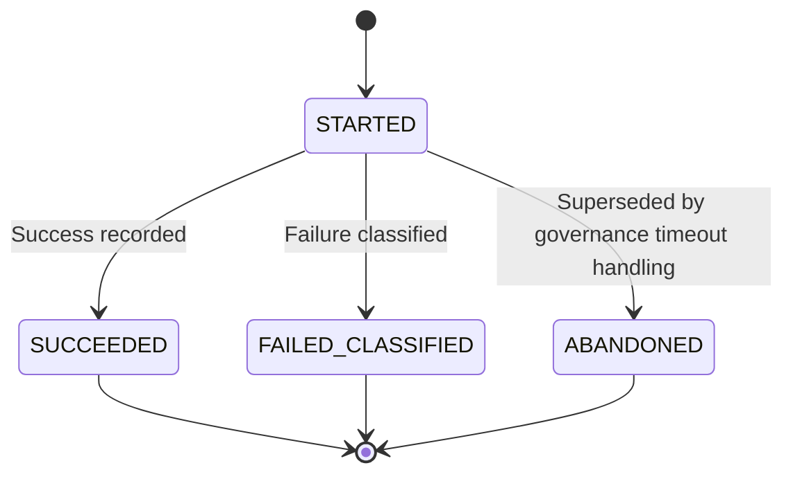

# Blueprint: feat-TKT002-02-retry-failure-convergence

## 模块 A：数据模型抽象 (Domain Structs)

```ts
type FulfillmentId = String
type FulfillmentAttemptId = String
type OrderId = String
type AuditId = String
type Version = Int
type Timestamp = String
type Duration = String
type Int = number
type Boolean = boolean
type String = string

type FulfillmentStatus =
  | 'PENDING'
  | 'PROCESSING'
  | 'RETRY_PENDING'
  | 'MANUAL_PENDING'
  | 'SUCCEEDED'
  | 'FAILED'

type AttemptExecutionStatus =
  | 'STARTED'
  | 'SUCCEEDED'
  | 'FAILED_CLASSIFIED'
  | 'ABANDONED'

type FailureCategory =
  | 'RETRYABLE_TECHNICAL_FAILURE'
  | 'FINAL_BUSINESS_REJECTED'
  | 'MANUAL_REVIEW_REQUIRED'
  | 'UNCERTAIN_RESULT'

type FailureReasonCode =
  | 'NETWORK_TIMEOUT'
  | 'GATEWAY_TEMPORARY_ERROR'
  | 'PROVIDER_RATE_LIMITED'
  | 'PROVIDER_TEMPORARILY_UNAVAILABLE'
  | 'FULFILLMENT_WINDOW_EXPIRED'
  | 'ORDER_CONDITION_INVALID'
  | 'PROVIDER_PERMANENT_REJECTED'
  | 'UPSTREAM_DATA_REQUIRES_REVIEW'
  | 'MANUAL_SOURCE_SWITCH_REQUIRED'
  | 'EXTERNAL_RESULT_UNKNOWN'
  | 'PROCESSING_STUCK_SAFE_TO_RETRY'
  | 'PROCESSING_STUCK_UNSAFE_TO_RETRY'

type AttemptTrigger =
  | 'INITIAL_EXECUTION'
  | 'FAST_RETRY'
  | 'BACKOFF_RETRY'
  | 'PROCESSING_TIMEOUT_GOVERNANCE'

type RetryAttemptTrigger =
  | 'FAST_RETRY'
  | 'BACKOFF_RETRY'

interface Fulfillment {
  fulfillmentId: FulfillmentId
  orderId: OrderId
  status: FulfillmentStatus
  retryPolicy: RetryPolicySnapshot
  retryState: RetryState
  currentProcessingLease?: ProcessingLease
  latestAttemptId?: FulfillmentAttemptId
  latestFailure?: FailureDecision
  version: Version
  updatedAt: Timestamp
}

interface RetryPolicySnapshot {
  fastRetryLimit: Int
  backoffRetryLimit: Int
  totalRetryBudget: Int
  backoffSchedule: Duration[]
}

interface RetryState {
  fastRetryUsed: Int
  backoffRetryUsed: Int
  totalRetryUsed: Int
  nextRetryAt?: Timestamp
  budgetExhausted: Boolean
}

interface ProcessingLease {
  processingStartedAt: Timestamp
  timeoutAt: Timestamp
}

interface FulfillmentAttempt {
  attemptId: FulfillmentAttemptId
  fulfillmentId: FulfillmentId
  sequenceNo: Int
  trigger: AttemptTrigger
  executionStatus: AttemptExecutionStatus
  startedAt: Timestamp
  endedAt?: Timestamp
  failureDecision?: FailureDecision
  providerDiagnostic?: ProviderDiagnostic
}

interface FailureDecision {
  category: FailureCategory
  reasonCode: FailureReasonCode
  retryDisposition: RetryDisposition
  manualReviewRequired: Boolean
  finalTerminationSuggested: Boolean
  rationale: String
  classifiedAt: Timestamp
}

type RetryDisposition =
  | 'ALLOW_FAST_RETRY'
  | 'ALLOW_BACKOFF_RETRY'
  | 'STOP_AND_MANUAL'
  | 'STOP_AND_FINAL_FAIL'

interface ProviderDiagnostic {
  providerCode?: String
  providerMessage?: String
  rawOutcomeKnown: Boolean
}

interface GovernanceAuditRecord {
  auditId: AuditId
  fulfillmentId: FulfillmentId
  attemptId?: FulfillmentAttemptId
  actionType: GovernanceActionType
  fromStatus?: FulfillmentStatus
  toStatus?: FulfillmentStatus
  failureCategory?: FailureCategory
  reasonCode?: FailureReasonCode
  retryBudgetSnapshot?: RetryState
  actorType: 'SYSTEM'
  occurredAt: Timestamp
}

type GovernanceActionType =
  | 'ATTEMPT_STARTED'
  | 'ATTEMPT_ABANDONED'
  | 'ATTEMPT_CLASSIFIED'
  | 'FAST_RETRY_SCHEDULED'
  | 'BACKOFF_RETRY_SCHEDULED'
  | 'MOVED_TO_RETRY_PENDING'
  | 'MOVED_TO_MANUAL_PENDING'
  | 'MOVED_TO_FAILED'
  | 'MOVED_TO_SUCCEEDED'
  | 'PROCESSING_TIMEOUT_GOVERNED'
```

### 逻辑关联

```ts
Fulfillment 1 --- N FulfillmentAttempt
Fulfillment 1 --- N GovernanceAuditRecord
Fulfillment 1 --- 1 RetryPolicySnapshot
Fulfillment 1 --- 1 RetryState
Fulfillment 1 --- 0..1 ProcessingLease
FulfillmentAttempt 1 --- 0..1 FailureDecision
FulfillmentAttempt 1 --- 0..1 ProviderDiagnostic
```

## 模块 B：接口契约 (API Contracts)

### Error Codes

```ts
enum ErrorCode {
  FULFILLMENT_NOT_FOUND,
  INVALID_STATUS_TRANSITION,
  ATTEMPT_ALREADY_FINALIZED,
  FAILURE_DECISION_REQUIRED,
  FAILURE_CATEGORY_NOT_RETRYABLE,
  RETRY_BUDGET_EXHAUSTED,
  FAST_RETRY_ALREADY_USED,
  NEXT_RETRY_NOT_DUE,
  PROCESSING_NOT_TIMED_OUT,
  IDEMPOTENT_REPLAY_CONFLICT,
  CONCURRENCY_VERSION_MISMATCH
}
```

### 1. ClassifyAttemptFailure

```ts
interface ClassifyAttemptFailureCommand {
  fulfillmentId: FulfillmentId
  attemptId: FulfillmentAttemptId
  idempotencyKey: String
  expectedVersion: Version
  observedFailure: {
    providerCode?: String
    providerMessage?: String
    rawOutcomeKnown: Boolean
    failureSignal: String
  }
}

interface ClassifyAttemptFailureResult {
  fulfillment: Fulfillment
  attempt: FulfillmentAttempt
  decision: FailureDecision
  emittedAuditRecords: GovernanceAuditRecord[]
}
```

前置条件：

- `Fulfillment.status` 必须为 `PROCESSING`。
- `FulfillmentAttempt.executionStatus` 不能已经是终态。
- 必须给出足够的观测信息以形成唯一一级分类。

业务规则：

- `RETRYABLE_TECHNICAL_FAILURE`：进入 `RETRY_PENDING`，并决定是 `ALLOW_FAST_RETRY` 或 `ALLOW_BACKOFF_RETRY`。
- `FINAL_BUSINESS_REJECTED`：直接进入 `FAILED`。
- `MANUAL_REVIEW_REQUIRED`：进入 `MANUAL_PENDING`。
- `UNCERTAIN_RESULT`：进入 `MANUAL_PENDING`，不得进入自动重试。

可能返回的 `ErrorCode`：

- `FULFILLMENT_NOT_FOUND`
- `ATTEMPT_ALREADY_FINALIZED`
- `FAILURE_DECISION_REQUIRED`
- `INVALID_STATUS_TRANSITION`
- `IDEMPOTENT_REPLAY_CONFLICT`
- `CONCURRENCY_VERSION_MISMATCH`

### 2. ScheduleRetryAfterFailure

```ts
interface ScheduleRetryAfterFailureCommand {
  fulfillmentId: FulfillmentId
  idempotencyKey: String
  expectedVersion: Version
  requestedMode: 'FAST_RETRY' | 'BACKOFF_RETRY'
  now: Timestamp
}

interface ScheduleRetryAfterFailureResult {
  fulfillment: Fulfillment
  scheduledAttemptTrigger: RetryAttemptTrigger
  nextRetryAt?: Timestamp
  emittedAuditRecords: GovernanceAuditRecord[]
}
```

前置条件：

- `Fulfillment.status` 必须为 `RETRY_PENDING`。
- 最近一次 `FailureDecision.category` 必须为 `RETRYABLE_TECHNICAL_FAILURE`。
- `requestedMode` 必须与当前预算及节奏约束一致。

业务规则：

- `FAST_RETRY` 仅允许在首次可重试失败后触发 1 次。
- 快速重试失败后，只能进入退避重试或退出人工，不得再次连续快速重试。
- 当总预算耗尽时，不得再排入自动重试，应改为进入 `MANUAL_PENDING`。

可能返回的 `ErrorCode`：

- `INVALID_STATUS_TRANSITION`
- `FAILURE_CATEGORY_NOT_RETRYABLE`
- `FAST_RETRY_ALREADY_USED`
- `RETRY_BUDGET_EXHAUSTED`
- `NEXT_RETRY_NOT_DUE`
- `IDEMPOTENT_REPLAY_CONFLICT`
- `CONCURRENCY_VERSION_MISMATCH`

### 3. StartRetryAttempt

```ts
interface StartRetryAttemptCommand {
  fulfillmentId: FulfillmentId
  trigger: RetryAttemptTrigger
  idempotencyKey: String
  expectedVersion: Version
  now: Timestamp
}

interface StartRetryAttemptResult {
  fulfillment: Fulfillment
  attempt: FulfillmentAttempt
  emittedAuditRecords: GovernanceAuditRecord[]
}
```

前置条件：

- `Fulfillment.status` 必须为 `RETRY_PENDING`。
- `trigger` 只允许为 `FAST_RETRY` 或 `BACKOFF_RETRY`。
- 若 `trigger` 为 `BACKOFF_RETRY`，则 `now >= retryState.nextRetryAt`。

业务规则：

- `StartRetryAttempt` 仅覆盖自动重试 attempt 的启动，不负责首次执行，也不接受超时治理触发源。
- 启动新的 retry attempt 时，`Fulfillment` 进入 `PROCESSING`。
- attempt 的 `sequenceNo` 必须在同一 `Fulfillment` 内单调递增。
- 同一调度键重复提交不得创建第二个并行 attempt。

可能返回的 `ErrorCode`：

- `INVALID_STATUS_TRANSITION`
- `NEXT_RETRY_NOT_DUE`
- `IDEMPOTENT_REPLAY_CONFLICT`
- `CONCURRENCY_VERSION_MISMATCH`

### 4. GovernProcessingTimeout

```ts
interface GovernProcessingTimeoutCommand {
  fulfillmentId: FulfillmentId
  idempotencyKey: String
  expectedVersion: Version
  now: Timestamp
  safeToRetryEvidence: {
    confirmedNotSucceeded: Boolean
    duplicateExecutionRiskControllable: Boolean
  }
}

interface GovernProcessingTimeoutResult {
  fulfillment: Fulfillment
  attempt: FulfillmentAttempt
  decision: FailureDecision
  emittedAuditRecords: GovernanceAuditRecord[]
}
```

前置条件：

- `Fulfillment.status` 必须为 `PROCESSING`。
- `now >= currentProcessingLease.timeoutAt`。

业务规则：

- 当前活跃 `FulfillmentAttempt.executionStatus` 必须从 `STARTED` 转为 `ABANDONED`，表示该 attempt 已被超时治理接管，不再允许继续作为活跃执行分支推进。
- 仅当 `confirmedNotSucceeded=true` 且 `duplicateExecutionRiskControllable=true` 时，才可认定存在“尚未成功且可安全重试”的充分证据，并生成 `FailureDecision { category: 'RETRYABLE_TECHNICAL_FAILURE', reasonCode: 'PROCESSING_STUCK_SAFE_TO_RETRY', retryDisposition: 'ALLOW_FAST_RETRY' | 'ALLOW_BACKOFF_RETRY' }`，再收敛至 `RETRY_PENDING`。
- 当 `confirmedNotSucceeded=false`、`duplicateExecutionRiskControllable=false`，或任一条件无法确认时，必须生成 `FailureDecision { category: 'UNCERTAIN_RESULT', reasonCode: 'PROCESSING_STUCK_UNSAFE_TO_RETRY' | 'EXTERNAL_RESULT_UNKNOWN' }`，并把 `Fulfillment` 转入 `MANUAL_PENDING`。
- 不要求精确判断真实外部阶段，只要求判断是否可安全自动下一步。
- 审计记录除 `PROCESSING_TIMEOUT_GOVERNED` 外，还必须包含一条绑定当前 `attemptId` 的 `ATTEMPT_ABANDONED`，用于证明 attempt 层状态已经闭环。

可能返回的 `ErrorCode`：

- `INVALID_STATUS_TRANSITION`
- `PROCESSING_NOT_TIMED_OUT`
- `IDEMPOTENT_REPLAY_CONFLICT`
- `CONCURRENCY_VERSION_MISMATCH`

### 5. RecordAttemptSuccess

```ts
interface RecordAttemptSuccessCommand {
  fulfillmentId: FulfillmentId
  attemptId: FulfillmentAttemptId
  idempotencyKey: String
  expectedVersion: Version
  now: Timestamp
}

interface RecordAttemptSuccessResult {
  fulfillment: Fulfillment
  attempt: FulfillmentAttempt
  emittedAuditRecords: GovernanceAuditRecord[]
}
```

前置条件：

- `Fulfillment.status` 必须为 `PROCESSING`。
- 对应 attempt 必须为当前活跃 attempt。

业务规则：

- 成功后 `Fulfillment` 进入 `SUCCEEDED`。
- 已经进入终局或治理出口的对象，重复成功回放不得制造双终局。

可能返回的 `ErrorCode`：

- `INVALID_STATUS_TRANSITION`
- `ATTEMPT_ALREADY_FINALIZED`
- `IDEMPOTENT_REPLAY_CONFLICT`
- `CONCURRENCY_VERSION_MISMATCH`

### 6. GetFulfillmentGovernanceView

```ts
interface GetFulfillmentGovernanceViewQuery {
  fulfillmentId: FulfillmentId
}

interface GetFulfillmentGovernanceViewResult {
  fulfillment: Fulfillment
  latestAttempt?: FulfillmentAttempt
  latestFailure?: FailureDecision
  retryState: RetryState
  recentAuditRecords: GovernanceAuditRecord[]
}
```

用途：

- 提供运营与后续人工治理读取统一治理语义。
- 输出必须能明确区分 `RETRY_PENDING`、`MANUAL_PENDING`、`FAILED` 的差异。

可能返回的 `ErrorCode`：

- `FULFILLMENT_NOT_FOUND`

## 模块 C：状态流转与核心策略 (State Machine & Strategies)

### Fulfillment 状态机



### Attempt 执行语义



### 核心策略

- 幂等落点：`ClassifyAttemptFailure`、`ScheduleRetryAfterFailure`、`StartRetryAttempt`、`GovernProcessingTimeout`、`RecordAttemptSuccess` 都必须要求 `idempotencyKey`，并以 `fulfillmentId + operationType + idempotencyKey` 识别重复请求。
- 并发控制落点：所有命令都必须携带 `expectedVersion`，围绕 `Fulfillment.version` 做单聚合并发保护，防止重复调度导致双 attempt、双出口或预算重复扣减。
- 分类优先策略：任何自动重试之前必须先产生 `FailureDecision`；不存在“失败即重试”的旁路。
- 快速重试策略：仅限首次 `RETRYABLE_TECHNICAL_FAILURE` 后的 1 次即时动作；若这次仍失败，只允许退避重试或退出人工。
- 退避预算策略：`RetryPolicySnapshot.totalRetryBudget` 必须是小额度固定预算；预算耗尽时只能从 `RETRY_PENDING` 转 `MANUAL_PENDING`。
- 结果未知策略：`UNCERTAIN_RESULT` 一律阻断自动重试，即使 provider 原始码看起来像技术异常，也不能越过平台一级分类。
- stuck processing 策略：`PROCESSING` 超时后，不要求精确识别外部真实进度；只有 `confirmedNotSucceeded=true` 且 `duplicateExecutionRiskControllable=true` 时才允许生成 `RETRYABLE_TECHNICAL_FAILURE` + `PROCESSING_STUCK_SAFE_TO_RETRY` 并转入 `RETRY_PENDING`，否则一律生成 `UNCERTAIN_RESULT`（`PROCESSING_STUCK_UNSAFE_TO_RETRY` 或 `EXTERNAL_RESULT_UNKNOWN`）并转 `MANUAL_PENDING`。
- attempt 接管策略：`GovernProcessingTimeout` 一旦成功执行，当前活跃 attempt 必须同步从 `STARTED` 改写为 `ABANDONED`，并输出可审计的 `ATTEMPT_ABANDONED` 记录，避免 `Fulfillment` 已离开 `PROCESSING` 而 attempt 仍停留在 `STARTED`。
- 审计策略：每次分类、预算消耗、状态迁移、自动重试排程、超时治理都必须生成 `GovernanceAuditRecord`，保证运营可解释与后续人工接管可诊断。
