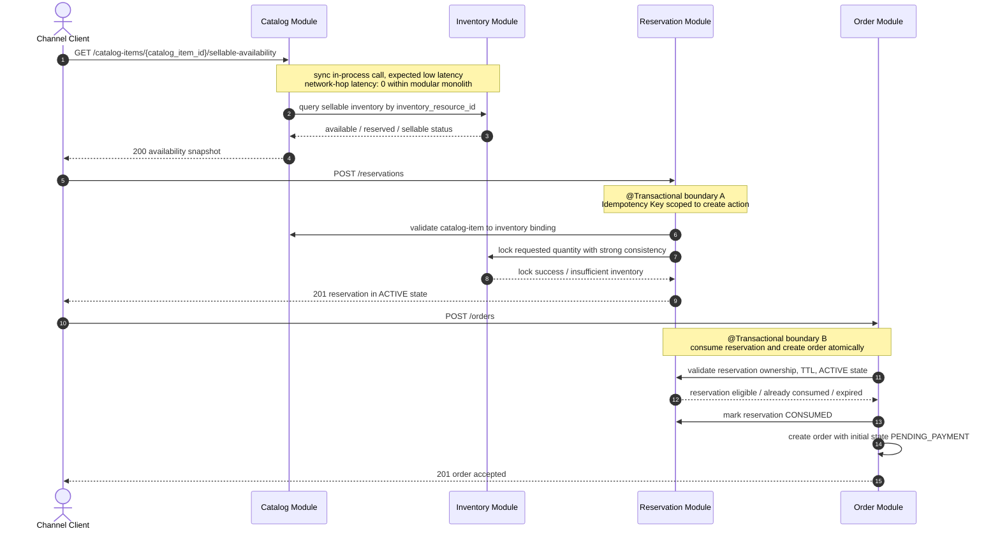
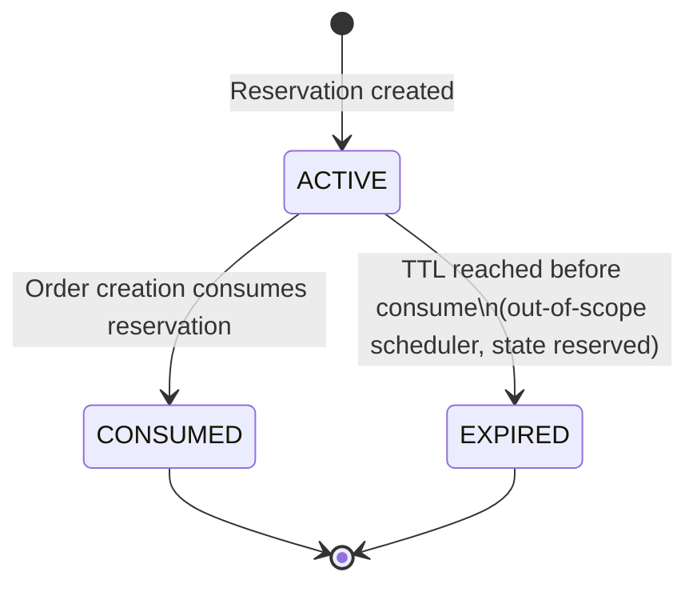
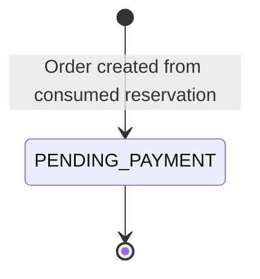

# RFC-TKT001-01: reservation-and-order-backbone

## Metadata

* **Epic:** `docs/02_epics/EPIC-TKT-001-core-transaction-backbone.md`
* **Status:** DRAFT / SUCCESS
* **Owner:** qinric
* **Created At:** 2026-04-03

---

## 1. 背景与目标 (Context & Objective)
> **Filled by `requirement-analyst` during REQUIREMENT phase**

* **Summary:** 本次变更聚焦 `EPIC-TKT-001` 的首个 RFC，目的是把交易主链路中“支付前”的基础骨架先收敛下来，明确最小 Catalog 配置、可售库存同步查询、Reservation 创建、Reservation 被 Order consume，以及 Order 以 `PENDING_PAYMENT` 进入系统的基本边界。该 RFC 只负责建立 `Reservation -> Order` 这段主链路，不引入 Payment Confirmation、Fulfillment Trigger 或超时释放调度。

* **Business Value:** 先把库存锁定与订单落点建稳，才能避免后续支付确认、履约推进和渠道接入建立在不稳定的交易起点之上。该 RFC 完成后，系统将具备“可售判断、锁票、创单”的最小交易起步能力，为后续 RFC-02 和 RFC-03 提供稳定前提。

---

## 2. 范围与边界 (Scope & Boundaries)

> **Filled by `requirement-analyst`**

* **✅ In-Scope:**
  * 最小可用 Catalog 配置能力，用于表达可售商品与库存资源之间的绑定关系。
  * 面向锁票前校验的可售库存同步查询能力。
  * Reservation 作为独立业务对象存在，支持创建，并具备“可被 consume 一次”的约束目标。
  * Order 创建主流程，且初始有效状态仅进入 `PENDING_PAYMENT`。
  * 明确 `Reservation -> Order` 的依赖关系，即 Order 以前置 Reservation 为基础建立，不允许绕过 Reservation 直接进入正常创单主链路。
  * 为后续 Payment Confirmation、Timeout Release、Audit Trail 补强保留稳定业务边界与对象关系。

* **❌ Out-of-Scope:**
  * Payment Confirmation 的接入、回放处理与幂等推进。
  * `Order.PENDING_PAYMENT -> Order.CONFIRMED` 的状态推进。
  * `Fulfillment.PENDING` 的创建与任何实际履约执行。
  * 未支付超时关闭、定时扫描释放与 Reservation 联动释放机制。
  * 复杂多渠道协议、渠道回调适配与对外 Headless contract 暴露。
  * Refund、Cancellation、人工纠偏、运营治理和高级补偿编排。

---

## 3. 模糊点与抉择矩阵 (Ambiguities & Decision Matrix)

> **Identified by `requirement-analyst`, resolved by human or `system-architect`**
> *If empty -> proceed to design phase*

当前 RFC 无新增模糊点；进入设计阶段时应直接继承以下已确认前提，不再重复争论：

| ID | Ambiguity / Decision Point | Option A | Option B | Final Decision (ADR) |
| :- | :------------------------- | :------- | :------- | :------------------- |
| 1 | 库存控制基线 | 引入缓存/预扣减模型 | 单库事务 + 强一致并发控制 | Inherited from `EPIC-TKT-001`: Option B |
| 2 | 幂等策略边界 | 仅保留统一交易号 | `external_trade_no` 串联交易，并保留动作级 Idempotency Key | Inherited from `EPIC-TKT-001`: hybrid strategy |
| 3 | Reservation 与 Order 关系 | 允许绕过 Reservation 直接创建正常 Order | Reservation 必须先于 Order 存在，Order 创建时 consume Reservation | Inherited from `EPIC-TKT-001`: Option B |

---

## 4. 技术实现图纸 (Technical Design)

> **MUST NOT proceed unless Section 3 is fully resolved**

### 4.1 Behavior Modeling

**Selected Lens:** `Backend/Microservices Lens`

本 RFC 虽然运行在 `modular monolith` 内，但其关键问题仍然是交易边界、一致性和跨模块调用顺序，因此采用 `Backend/Microservices Lens` 来约束设计。设计重点如下：

* `Catalog -> Inventory -> Reservation -> Order` 必须保持同步判定与清晰边界，避免出现“已创单但未锁票”或“已锁票但无订单落点”的悬空状态。
* `Reservation create` 与 `Reservation consume + Order create` 是两个独立命令，各自需要动作级 Idempotency 保护。
* `Reservation consume + Order create` 必须处在同一个本地事务边界内，以确保“只能 consume 一次”和“Order 初始状态固定为 `PENDING_PAYMENT`”同时成立。







### 4.2 Contract Definition

`docs/01_registries/api-catalog.yaml` 当前为空，因此本节直接定义本 RFC 的 source-of-truth contract，后续由治理阶段再沉淀到 registry。

#### 4.2.1 API Surface

| Capability | Method | Path | Purpose |
| :-- | :-- | :-- | :-- |
| Sellable availability query | `GET` | `/catalog-items/{catalog_item_id}/sellable-availability` | 查询商品当前可售快照，供锁票前同步校验 |
| Create reservation | `POST` | `/reservations` | 创建 `Reservation.ACTIVE`，并占用库存 |
| Create order from reservation | `POST` | `/orders` | consume Reservation 并创建 `Order.PENDING_PAYMENT` |

#### 4.2.2 Shared Business Rules

* `catalog_item_id` 是面向渠道暴露的商品标识；其与底层库存资源的绑定关系由 Catalog 模块维护。
* `external_trade_no` 作为整笔交易的关联键，在 Reservation 和 Order 请求里都必须出现。
* `Idempotency-Key` 采用动作级语义：`POST /reservations` 与 `POST /orders` 不共享同一幂等结果缓存。
* `reservation_id` 是创建 Order 的必填前置条件，不允许正常主链路绕过 Reservation 直接创单。

#### 4.2.3 JSON Contracts

```json
{
  "$id": "sellable-availability-response",
  "type": "object",
  "required": [
    "catalog_item_id",
    "inventory_resource_id",
    "sellable_quantity",
    "reserved_quantity",
    "status",
    "checked_at"
  ],
  "properties": {
    "catalog_item_id": { "type": "string" },
    "inventory_resource_id": { "type": "string" },
    "sellable_quantity": { "type": "integer", "minimum": 0 },
    "reserved_quantity": { "type": "integer", "minimum": 0 },
    "status": {
      "type": "string",
      "enum": ["SELLABLE", "LOW_STOCK", "SOLD_OUT", "OFF_SHELF"]
    },
    "checked_at": { "type": "string", "format": "date-time" }
  }
}
```

```json
{
  "$id": "create-reservation-request",
  "type": "object",
  "required": [
    "external_trade_no",
    "catalog_item_id",
    "quantity",
    "reservation_ttl_seconds"
  ],
  "properties": {
    "external_trade_no": { "type": "string", "minLength": 1 },
    "catalog_item_id": { "type": "string", "minLength": 1 },
    "quantity": { "type": "integer", "minimum": 1 },
    "reservation_ttl_seconds": { "type": "integer", "minimum": 30 },
    "channel_context": {
      "type": "object",
      "additionalProperties": { "type": "string" }
    }
  }
}
```

```json
{
  "$id": "create-reservation-response",
  "type": "object",
  "required": [
    "reservation_id",
    "external_trade_no",
    "catalog_item_id",
    "quantity",
    "status",
    "expires_at"
  ],
  "properties": {
    "reservation_id": { "type": "string" },
    "external_trade_no": { "type": "string" },
    "catalog_item_id": { "type": "string" },
    "quantity": { "type": "integer", "minimum": 1 },
    "status": {
      "type": "string",
      "enum": ["ACTIVE", "CONSUMED", "EXPIRED"]
    },
    "expires_at": { "type": "string", "format": "date-time" }
  }
}
```

```json
{
  "$id": "create-order-request",
  "type": "object",
  "required": [
    "external_trade_no",
    "reservation_id",
    "buyer"
  ],
  "properties": {
    "external_trade_no": { "type": "string", "minLength": 1 },
    "reservation_id": { "type": "string", "minLength": 1 },
    "buyer": {
      "type": "object",
      "required": ["buyer_ref"],
      "properties": {
        "buyer_ref": { "type": "string", "minLength": 1 },
        "contact_phone": { "type": "string" },
        "contact_email": { "type": "string" }
      }
    },
    "submission_context": {
      "type": "object",
      "additionalProperties": { "type": "string" }
    }
  }
}
```

```json
{
  "$id": "create-order-response",
  "type": "object",
  "required": [
    "order_id",
    "external_trade_no",
    "reservation_id",
    "status",
    "payment_deadline_at"
  ],
  "properties": {
    "order_id": { "type": "string" },
    "external_trade_no": { "type": "string" },
    "reservation_id": { "type": "string" },
    "status": {
      "type": "string",
      "enum": ["PENDING_PAYMENT"]
    },
    "payment_deadline_at": { "type": "string", "format": "date-time" }
  }
}
```

#### 4.2.4 Error Contract

```json
{
  "$id": "error-response",
  "type": "object",
  "required": ["code", "message", "request_id"],
  "properties": {
    "code": {
      "type": "string",
      "enum": [
        "CATALOG_ITEM_NOT_SELLABLE",
        "INSUFFICIENT_INVENTORY",
        "RESERVATION_NOT_FOUND",
        "RESERVATION_ALREADY_CONSUMED",
        "RESERVATION_EXPIRED",
        "IDEMPOTENCY_CONFLICT"
      ]
    },
    "message": { "type": "string" },
    "request_id": { "type": "string" },
    "retryable": { "type": "boolean" }
  }
}
```

### 4.3 Storage Design

#### 4.3.1 Schema Registry Check

`docs/01_registries/schema-summary.md` 当前为空，说明本 RFC 涉及的 `Catalog`、`Inventory`、`Reservation`、`Order` 与动作级 `Idempotency` 均不存在现成 Schema。本次物理设计因此全部采用 `CREATE TABLE`，不引入任何 `ALTER TABLE`。

结合当前项目默认技术栈 `Java + Spring Boot + MyBatis-Plus + Flyway`，本节以首批可落库、可迁移、可被后续实现直接消费为目标，统一采用：

* 字符串业务主键，避免在 RFC 阶段绑定具体 ID 生成器实现。
* `MySQL 8` 兼容 DDL 风格，确保字段 `COMMENT` 可在 migration 内直接声明。
* 初始 migration 仅定义 `PK` 与 `UK`，不提前加入普通查询索引，遵守 DBA 阶段红线。

#### 4.3.2 Entity Derivation

| Table | Purpose | Key Fields | Derivation Logic |
| :-- | :-- | :-- | :-- |
| `catalog_item` | 保存渠道可见商品与底层库存资源的绑定关系 | `catalog_item_id`, `inventory_resource_id`, `status` | 来自 `GET /catalog-items/{catalog_item_id}/sellable-availability` 与 Reservation 创建前的绑定校验需求 |
| `inventory_resource` | 保存库存资源总量、已预留量与并发控制基线 | `inventory_resource_id`, `total_quantity`, `reserved_quantity`, `version` | 来自“strong consistency lock”与并发抢占场景，需要可原子更新的数量字段和乐观锁版本列 |
| `reservation_record` | 保存 Reservation 生命周期与 TTL | `reservation_id`, `external_trade_no`, `status`, `expires_at`, `consumed_at`, `version` | 来自 `ACTIVE -> CONSUMED / EXPIRED` 状态图，以及 consume 时只能成功一次的约束 |
| `ticket_order` | 保存由 Reservation 派生的 Order 主记录 | `order_id`, `reservation_id`, `external_trade_no`, `status`, `payment_deadline_at` | 来自 Order 只能通过 Reservation 创建，且初始态固定为 `PENDING_PAYMENT` |
| `idempotency_record` | 保存动作级 Idempotency 命中结果与请求摘要 | `action_name`, `idempotency_key`, `request_hash`, `resource_id` | 来自 `POST /reservations` 与 `POST /orders` 需要隔离幂等空间，并对“同 key 不同请求体”返回 `IDEMPOTENCY_CONFLICT` |

#### 4.3.3 Table Design Details

**1. `catalog_item`**

* `catalog_item_id` 作为渠道暴露的业务主键。
* `inventory_resource_id` 作为底层库存资源引用，保持 `Catalog -> Inventory` 的单跳绑定。
* `status` 用于表达商品是否允许进入可售判断，建议枚举值为 `DRAFT / ACTIVE / OFF_SHELF`。
* `version` 与审计列用于支撑后续配置变更和乐观并发控制。

**2. `inventory_resource`**

* `total_quantity` 与 `reserved_quantity` 足以支撑当前 RFC 的 sellable snapshot 计算，`sellable_quantity = total_quantity - reserved_quantity` 由应用层投影。
* `status` 用于表达库存资源是否仍可参与售卖，例如 `ACTIVE / FROZEN / OFFLINE`。
* `version` 是并发控制核心字段，用于 Reservation 创建时的强一致扣减与释放回滚。
* 本 RFC 不引入库存流水子表，因为还未进入支付确认、超时释放与审计补强阶段。

**3. `reservation_record`**

* `status` 映射状态图中的 `ACTIVE / CONSUMED / EXPIRED`。
* `expires_at` 直接承接 contract 中的 `reservation_ttl_seconds` 推导结果，避免只存 TTL 秒数导致重复计算。
* `consumed_order_id` 与 `consumed_at` 用于把 Reservation consume 与 Order 落点显式关联，方便后续审计与幂等回放。
* `version` 支撑 `ACTIVE -> CONSUMED` 的并发保护，避免同一 Reservation 被多次 consume。
* `external_trade_no` 保留整笔交易关联键，但不在本阶段对其建立唯一约束，因为同一交易在后续 RFC 可能还会引入更多动作记录。

**4. `ticket_order`**

* 表名避免直接使用 SQL 保留字 `order`。
* `reservation_id` 设置唯一约束，物理上确保一个 Reservation 最多只能落一个 Order。
* `status` 当前只允许 `PENDING_PAYMENT`，但保留枚举型字符串列，为 RFC-02 的 `CONFIRMED / CLOSED` 扩展留接口。
* `payment_deadline_at` 作为后续超时关闭扫描入口，即使本 RFC 不实现 scheduler，也需要先落字段。
* `buyer_ref`、`contact_phone`、`contact_email` 对应当前 contract 的 `buyer` 对象。

**5. `idempotency_record`**

* `action_name + idempotency_key` 形成唯一约束，确保动作级幂等空间隔离。
* `request_hash` 用于检测“相同 key、不同请求摘要”的冲突。
* `resource_type + resource_id` 用于回放既有业务结果，例如已创建的 Reservation 或 Order。
* `response_payload` 允许以 JSON 文本缓存上次成功结果，便于实现直接返回既定响应。
* `status` 预留 `PROCESSING / SUCCEEDED / FAILED`，既支撑当前 RFC，也为后续失败恢复留出口。

#### 4.3.4 Constraint Strategy

* `catalog_item.inventory_resource_id` 建立唯一约束，保证当前一个 Catalog item 只绑定一个库存资源，且一个库存资源不被多个最小商品记录重复占用。
* `reservation_record.reservation_id`、`ticket_order.order_id`、`inventory_resource.inventory_resource_id`、`catalog_item.catalog_item_id` 采用业务主键作为 `PK`。
* `ticket_order.reservation_id` 建立唯一约束，直接兑现“同一个 Reservation 只能被 consume 一次”的物理约束下界。
* `ticket_order.external_trade_no` 建立唯一约束，保证同一交易号在 Order 主表中只有一个最终落点。
* `idempotency_record (action_name, idempotency_key)` 建立唯一约束，用于动作级幂等命中。
* 不额外创建普通索引；后续若实现阶段通过真实查询模式证明需要，再由独立 RFC / migration 增补。

#### 4.3.5 Mapping Patterns Applied

* **State Consistency Pattern:** 为 `catalog_item`、`inventory_resource`、`reservation_record`、`ticket_order` 增加 `status` 字段，直接映射行为图中的状态约束。
* **Conflict Resolution Pattern:** 为 `inventory_resource` 与 `reservation_record` 增加 `version` 字段，支撑锁票并发与 consume 并发控制。
* **Reliability Pattern:** 增加 `idempotency_record`，并在 Reservation / Order 主表中保留 `expires_at`、`payment_deadline_at` 等可靠性字段。
* **Audit Pattern:** 所有表统一增加 `created_at`、`updated_at`，关键对象再补充 `consumed_at`，满足后续审计与问题追踪需要。

---

## 5. 异常分支与容灾 (Edge Cases & Failure Modes)

> **Derived by `system-architect`, rigorously tested by `qa-agent` and implemented by `implementation-agent`**

### Failure Scenario 1: 并发锁票导致库存争抢

* **Trigger:** 多个请求同时对同一 `catalog_item_id` 发起 `POST /reservations`，而剩余库存不足以满足全部请求。
* **Risk:** 若 Inventory lock 不是强一致，可能出现 oversell 或重复占用。
* **Fallback / Recovery:**
  * 在 `@Transactional boundary A` 内完成库存校验与锁定，失败则整个 Reservation 创建回滚。
  * 返回 `INSUFFICIENT_INVENTORY`，不得生成半有效 Reservation。
  * QA 必须覆盖同一库存资源上的并发抢占场景，验证只允许一个成功集或按库存上限成功。

### Failure Scenario 2: Reservation 已过期或已被 consume，仍尝试创单

* **Trigger:** 客户端重试或恶意重复提交 `POST /orders`，但目标 Reservation 已处于 `CONSUMED` 或 `EXPIRED`。
* **Risk:** 若状态检查不严，可能重复创单或把失效 Reservation 重新拉回主链路。
* **Fallback / Recovery:**
  * 在 `@Transactional boundary B` 开始时先校验 Reservation 状态，只允许 `ACTIVE` 进入 consume。
  * 对 `CONSUMED` 返回既定幂等结果或 `RESERVATION_ALREADY_CONSUMED`；对 `EXPIRED` 返回 `RESERVATION_EXPIRED`。
  * 严禁在失败分支中创建任何 `Order` 记录，确保 Order 与 Reservation 状态不分叉。

### Failure Scenario 3: consume Reservation 成功后，Order 创建中途失败

* **Trigger:** 在 `POST /orders` 内部，Reservation 状态已切换，但 Order 聚合创建、校验或事件记录过程抛错。
* **Risk:** 产生“Reservation 已不可用，但系统无对应 Order”的悬空事务。
* **Fallback / Recovery:**
  * `Reservation consume` 与 `Order create` 必须位于同一事务内，任一点失败即整体回滚。
  * 不允许先提交 Reservation 再异步补单；该复杂补偿不属于本 RFC。
  * 记录结构化错误日志，便于后续 `qa-agent` 和 `implementation-agent` 验证事务完整性。

### Failure Scenario 4: 动作级 Idempotency Key 与请求体不一致

* **Trigger:** 客户端复用同一个 `Idempotency-Key`，但提交了不同的 `external_trade_no`、`reservation_id` 或数量。
* **Risk:** 若系统仅按 key 命中，会把不同业务请求错误折叠为同一次动作。
* **Fallback / Recovery:**
  * Idempotency 记录除 key 外，还必须绑定动作名和请求摘要。
  * 若 key 命中但摘要不一致，返回 `IDEMPOTENCY_CONFLICT`，不得复用旧结果。
  * 在契约层明确动作级幂等隔离，避免 Reservation 与 Order 共享幂等空间。
