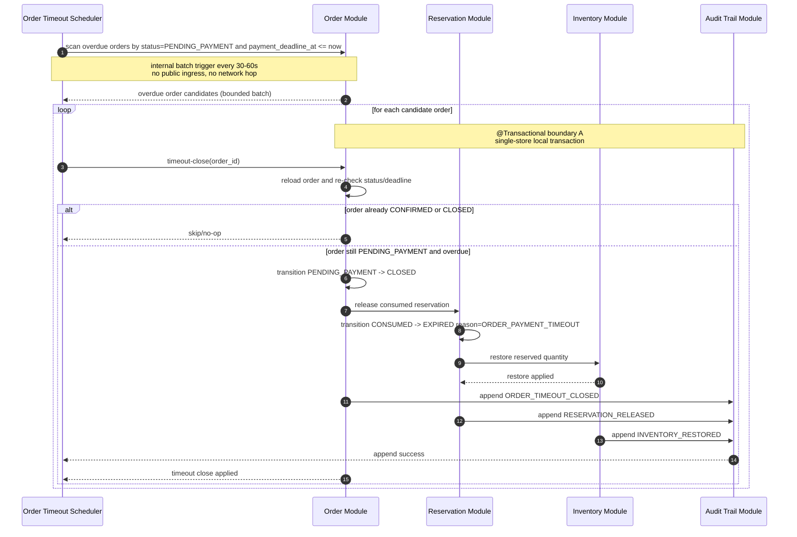
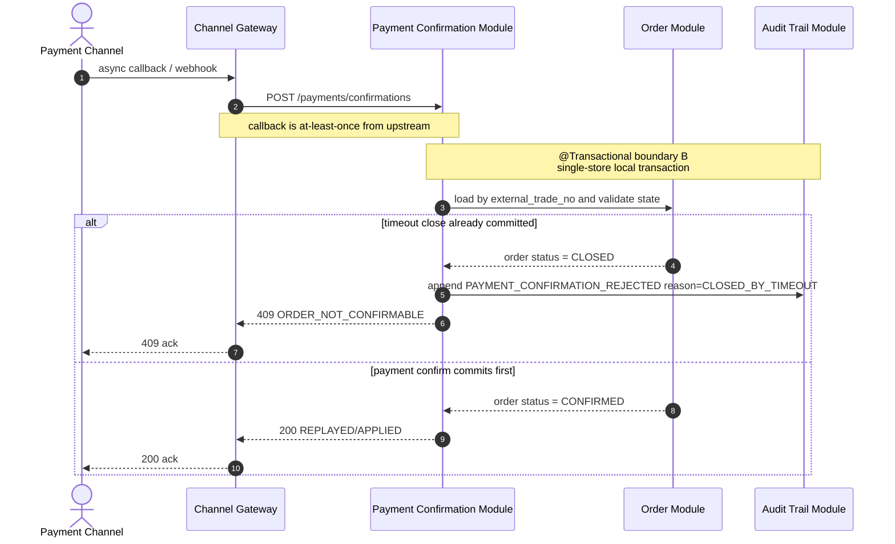
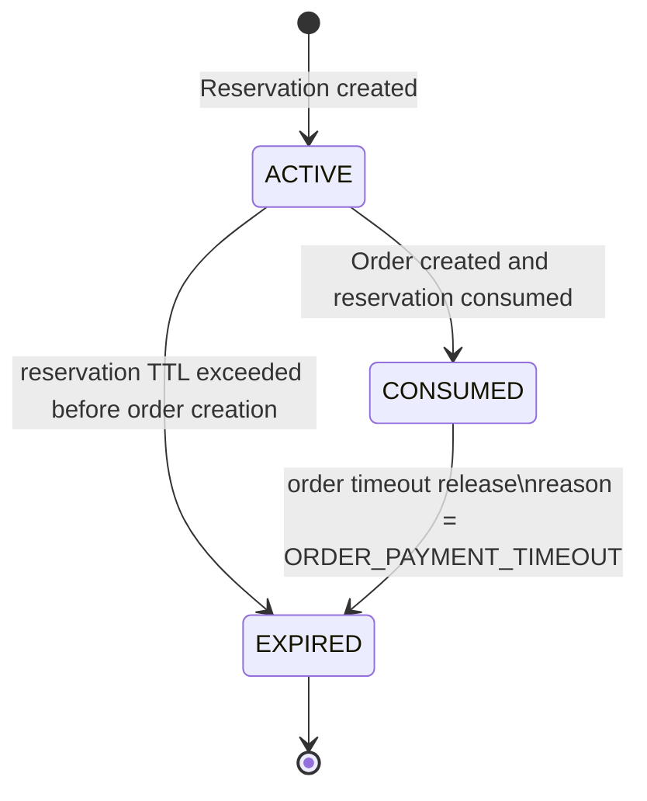
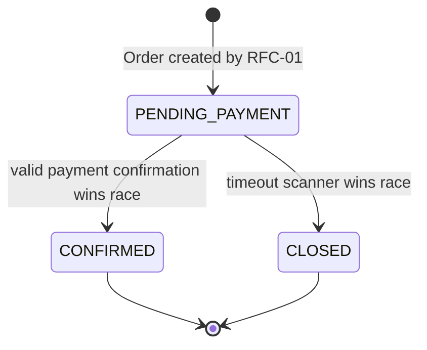

# RFC-TKT001-03: timeout-release-and-audit-trail-hardening

## Metadata

* **Epic:** `docs/02_epics/EPIC-TKT-001-core-transaction-backbone.md`
* **Status:** DRAFT / SUCCESS
* **Owner:** qinric
* **Created At:** 2026-04-08

---

## 1. 背景与目标 (Context & Objective)
> **Filled by `requirement-analyst` during REQUIREMENT phase**

* **Summary:** 本次变更聚焦 `EPIC-TKT-001` 的第三个 RFC，目标是在 `Reservation -> Order -> Payment Confirmation -> Fulfillment.PENDING` 主链路已经成立的前提下，补齐“未支付超时关闭、Reservation 联动释放、库存回补、关键状态留痕”这组稳定性底座。该 RFC 负责明确当 `Order.PENDING_PAYMENT` 超过支付截止时间后，系统如何可靠地关闭订单并释放关联资源；同时补齐 Reservation、Order、Payment Confirmation、Fulfillment 关键状态变化的基础 Audit Trail 要求。该 RFC 只锁定关闭、释放、留痕三类业务边界，不扩展为复杂治理中心。

* **Business Value:** 如果没有可靠的 Timeout Release，系统就会长期持有无效 Reservation 和被占用库存，最终侵蚀真实可售能力；如果没有基础 Audit Trail，后续出现超时关闭、晚到支付回调、重复释放或人工排障场景时，将无法证明系统是否按预期执行。该 RFC 完成后，`EPIC-TKT-001` 才算具备“能启动交易、能确认支付、也能正确收尾未完成交易”的完整骨架。

---

## 2. 范围与边界 (Scope & Boundaries)

> **Filled by `requirement-analyst`**

* **✅ In-Scope:**
  * 建立 `Order` 侧的 Timeout Release 业务边界，明确超时扫描只针对仍处于 `PENDING_PAYMENT` 且已超过 `payment_deadline_at` 的订单生效。
  * 明确超时关闭后 `Order` 必须进入 `CLOSED`，并与其关联的 `Reservation`、库存占用释放形成一致协同。
  * 明确被 `Order` consume 过的 `Reservation` 在超时关闭路径中的释放语义，包括状态收敛、重复释放防护与“只释放一次”的目标。
  * 明确库存回补属于本 RFC 的业务结果之一，要求超时关闭后恢复对应 `inventory_resource` 的可售数量。
  * 明确晚到 Payment Confirmation 的拒绝边界，即当订单已因超时关闭后，支付确认不得重新推进订单或重新创建 Fulfillment。
  * 补齐关键状态变化的基础 Audit Trail 范围，至少覆盖 Reservation 创建/consume/过期释放、Order 创建/确认/超时关闭、Payment Confirmation 接收结果、Fulfillment 创建等关键事件。
  * 为后续治理、对账和人工介入保留稳定事件边界与对象关联键，但不在本 RFC 内扩展查询后台或治理工作台。

* **❌ Out-of-Scope:**
  * `Fulfillment.PENDING` 之后的履约执行、失败恢复、后台重试与人工介入编排。
  * 多渠道 callback 安全校验、签名校验策略和复杂适配层扩展。
  * 引入 MQ、延迟消息、Outbox、CDC 等新的基础设施方案；本 RFC 仅冻结业务要求，不替代后续 design 决策。
  * Audit Trail 的对外查询 API、运营报表、审计报表或治理工作台。
  * Refund、Cancellation、逆向履约与对账补偿。
  * 高阶性能强化、分布式拆分和跨库一致性方案。

---

## 3. 模糊点与抉择矩阵 (Ambiguities & Decision Matrix)

> **Identified by `requirement-analyst`, resolved by human or `system-architect`**
> *If empty -> proceed to design phase*

当前 RFC 无新增模糊点；进入设计阶段时应直接继承以下已确认前提，不再重复争论：

| ID | Ambiguity / Decision Point | Option A | Option B | Final Decision (ADR) |
| :- | :------------------------- | :------- | :------- | :------------------- |
| 1 | Timeout Release 的触发方式 | 延迟消息 / timer 驱动 | 由 `Order` 侧定时扫描触发关闭与释放 | Inherited from `EPIC-TKT-001`: Option B |
| 2 | 超时关闭后的支付确认处理 | 允许补确认并尝试恢复 | 拒绝确认，保持 `CLOSED` 为终止态 | Inherited from `EPIC-TKT-001` + `RFC-TKT001-02`: Option B |
| 3 | Audit Trail 的本 RFC 边界 | 直接扩展成治理中心与查询平台 | 只补齐关键状态变化留痕与关联键 | Inherited from `EPIC-TKT-001`: Option B |
| 4 | 资源释放一致性基线 | 允许订单关闭、Reservation 释放、库存回补分步松耦合 | 在单体单库前提下优先追求强一致收敛 | Inherited from `EPIC-TKT-001`: correctness-first baseline |

---

## 4. 技术实现图纸 (Technical Design)

> **MUST NOT proceed unless Section 3 is fully resolved**

### 4.1 核心状态流转与交互 (Sequence & State)
**Selected Lens:** `Backend/Microservices Lens`

虽然当前系统形态仍是 `modular monolith`，但本 RFC 的关键问题是 Timeout Scanner、Payment Confirmation、Reservation/Inventory release 与 Audit Trail 之间的事务边界和一致性裁决，因此继续采用 `Backend/Microservices Lens`。本节冻结以下设计基线：

* Timeout Release 由 `Order` 域的内部定时扫描触发，不新增外部 API，也不引入延迟消息、MQ、Outbox 或 Saga。
* 在单体单库前提下，`Order.CLOSED`、`Reservation` 释放、库存回补与 Audit Trail append 必须在同一个本地事务内提交；若任一步失败，整笔关闭回滚并等待下一轮重试。
* 当前缺少正式容量数据，先采用有界假设：稳态 `PENDING_PAYMENT` backlog < 50k/day，单次扫描批量 < 500，扫描周期 30-60s；同一 `external_trade_no` 上的 Payment/Timeout 并发竞争是低频但必须严格正确。
* `Reservation` 沿用现有三态模型 `ACTIVE / CONSUMED / EXPIRED`，不为本 RFC 新增第四个释放态；由 Audit Trail 中的 `reason_code` 区分“TTL 过期”与“Order timeout release”。
* `POST /payments/confirmations` 的安全前置校验仍由 `Channel Gateway` 负责；本 RFC 只定义当订单已被超时关闭后，Payment Confirmation 必须被拒绝且不得重新开启交易。
* Audit Trail 只冻结“关键事件的最小 append-only contract 与关联键”，不扩展查询后台、运营报表或治理工作台。









#### 4.1.1 Boundary Definition

* `Order Module` 独占 Timeout Scanner 的触发编排、逾期订单判定以及 `Order.PENDING_PAYMENT -> CLOSED` 的状态所有权。
* `Reservation Module` 独占被 consume 的 Reservation 在 timeout close 路径中的释放收敛，语义表现为 `CONSUMED -> EXPIRED`，但原因由 Audit Trail 区分。
* `Inventory Module` 独占 `reserved_quantity` 的回补，不允许由 `Order Module` 直接改写库存聚合。
* `Payment Confirmation Module` 延续 RFC-02 的回调入口和幂等职责，但在本 RFC 内只新增“关闭后拒绝确认”的边界，不拥有 reopen 权限。
* `Operations & Governance / Audit Trail` 负责 append-only 审计事件接收、统一关联键与后续查询承接；它不裁决业务状态，只记录已经提交的业务事实。

#### 4.1.2 Consistency Strategy

* 由于 `Order`、`Reservation`、`Inventory` 与基础 Audit Trail 仍位于单体内单库写路径，本 RFC 采用 `strong consistency + local transaction`，不采用 `eventual consistency + async compensation`。
* Timeout Close 的“订单关闭、Reservation 释放、库存回补、Audit append”是一个不可拆分的业务原子单元；若 audit append 失败，则不得接受“主状态成功、审计缺失”的部分提交。
* Payment Confirmation 与 Timeout Scanner 对同一 `Order` 的竞争，必须通过条件状态迁移与并发控制基线裁决，保证只有一个终态转换成功。
* 扫描层允许重复发现候选订单，但执行层必须幂等：只有仍然满足 `PENDING_PAYMENT && payment_deadline_at <= now` 的订单才能真正进入关闭提交。

#### 4.1.3 Operability Notes

* 必须记录结构化日志字段：`scan_id`、`request_id`、`external_trade_no`、`order_id`、`reservation_id`、`inventory_resource_id`、`provider_event_id`、`decision`、`reason_code`。
* 必须暴露最小指标：`order_timeout_scan_total{outcome}`、`order_timeout_close_total{outcome}`、`order_timeout_release_latency_ms`、`late_payment_reject_total`、`audit_trail_append_total{event_type,outcome}`。
* 需提供运行保障基线：扫描批量上限、单轮耗时监控、连续失败告警、以及“关闭回滚后由下一轮扫描重试”的 runbook 说明。
* 安全约束：Audit Trail 不应原样持久化敏感支付 payload，只保留关联键、结果和必要的 `payload_summary`。

### 4.2 接口契约变更 (API Contracts)
`docs/01_registries/api-catalog.yaml` 已存在 RFC-01 / RFC-02 的对外 contract。本 RFC 不新增 public API，而是冻结 Timeout Scanner 的内部执行 contract 与基础 Audit Trail event contract，并明确 `POST /payments/confirmations` 在 timeout close 后的拒绝语义。

#### 4.2.1 API Surface

| Capability | Method | Path | Purpose |
| :-- | :-- | :-- | :-- |
| Payment confirmation rejection after timeout close | `POST` | `/payments/confirmations` | 复用 RFC-02 入口；当目标 `Order` 已被 timeout close 后返回稳定 `ORDER_NOT_CONFIRMABLE` |
| Timeout sweep execution | Internal Scheduler | `OrderTimeoutSweep` | 内部定时扫描并驱动超时关闭，不暴露为 public API |
| Audit append | Internal Contract | `AuditTrailAppend` | 记录关键状态变化与拒绝结果，供后续治理/排障使用 |

#### 4.2.2 Shared Business Rules

* Timeout Scanner 只能扫描 `status = PENDING_PAYMENT` 且 `payment_deadline_at <= now` 的订单；任何非逾期或非待支付订单都不得进入关闭提交。
* Timeout Close 成功时，必须在同一本地事务内同时完成 `Order.CLOSED`、`Reservation.CONSUMED -> EXPIRED`、库存回补，以及对应 Audit event append。
* 被 consume 的 Reservation 不引入新的 `RELEASED` 状态；统一收敛到 `EXPIRED`，并通过 `reason_code = ORDER_PAYMENT_TIMEOUT` 与原生 TTL 过期区分。
* 若 Payment Confirmation 到达时订单已 `CLOSED`，系统必须返回 `ORDER_NOT_CONFIRMABLE`，不得恢复订单、不得重建 Fulfillment；同时必须记录 `PAYMENT_CONFIRMATION_REJECTED` 审计事件。
* Audit Trail 最少覆盖以下事件：`RESERVATION_CREATED`、`RESERVATION_CONSUMED`、`RESERVATION_RELEASED`、`ORDER_CREATED`、`ORDER_CONFIRMED`、`ORDER_TIMEOUT_CLOSED`、`PAYMENT_CONFIRMATION_APPLIED`、`PAYMENT_CONFIRMATION_REPLAYED`、`PAYMENT_CONFIRMATION_REJECTED`、`FULFILLMENT_CREATED`、`INVENTORY_RESTORED`。
* 每条 Audit event 必须具备稳定关联键，至少包含 `external_trade_no` 和目标对象主键；若由 callback 驱动，还必须保留 `provider_event_id` 以支持排障。

#### 4.2.3 JSON Contracts

```json
{
  "$id": "order-timeout-sweep-candidate",
  "type": "object",
  "required": [
    "scan_id",
    "order_id",
    "external_trade_no",
    "reservation_id",
    "payment_deadline_at",
    "detected_at"
  ],
  "properties": {
    "scan_id": { "type": "string", "minLength": 1 },
    "order_id": { "type": "string", "minLength": 1 },
    "external_trade_no": { "type": "string", "minLength": 1 },
    "reservation_id": { "type": "string", "minLength": 1 },
    "payment_deadline_at": { "type": "string", "format": "date-time" },
    "detected_at": { "type": "string", "format": "date-time" }
  }
}
```

```json
{
  "$id": "audit-trail-event",
  "type": "object",
  "required": [
    "event_id",
    "event_type",
    "aggregate_type",
    "aggregate_id",
    "occurred_at",
    "external_trade_no",
    "actor_type",
    "reason_code"
  ],
  "properties": {
    "event_id": { "type": "string", "minLength": 1 },
    "event_type": {
      "type": "string",
      "enum": [
        "RESERVATION_CREATED",
        "RESERVATION_CONSUMED",
        "RESERVATION_RELEASED",
        "ORDER_CREATED",
        "ORDER_CONFIRMED",
        "ORDER_TIMEOUT_CLOSED",
        "PAYMENT_CONFIRMATION_APPLIED",
        "PAYMENT_CONFIRMATION_REPLAYED",
        "PAYMENT_CONFIRMATION_REJECTED",
        "FULFILLMENT_CREATED",
        "INVENTORY_RESTORED"
      ]
    },
    "aggregate_type": {
      "type": "string",
      "enum": [
        "RESERVATION",
        "ORDER",
        "PAYMENT_CONFIRMATION",
        "FULFILLMENT",
        "INVENTORY_RESOURCE"
      ]
    },
    "aggregate_id": { "type": "string", "minLength": 1 },
    "external_trade_no": { "type": "string", "minLength": 1 },
    "order_id": { "type": "string" },
    "reservation_id": { "type": "string" },
    "inventory_resource_id": { "type": "string" },
    "fulfillment_id": { "type": "string" },
    "provider_event_id": { "type": "string" },
    "actor_type": {
      "type": "string",
      "enum": ["SYSTEM", "CHANNEL", "OPERATOR"]
    },
    "actor_ref": { "type": "string" },
    "request_id": { "type": "string" },
    "idempotency_key": { "type": "string" },
    "reason_code": {
      "type": "string",
      "enum": [
        "ORDER_PAYMENT_TIMEOUT",
        "RESERVATION_TTL_EXPIRED",
        "PAYMENT_CONFIRMED",
        "PAYMENT_REPLAYED",
        "CLOSED_BY_TIMEOUT",
        "MANUAL_ACTION",
        "NOT_APPLICABLE"
      ]
    },
    "payload_summary": {
      "type": "object",
      "additionalProperties": { "type": ["string", "number", "boolean"] }
    },
    "occurred_at": { "type": "string", "format": "date-time" }
  }
}
```

#### 4.2.4 Error Contract

```json
{
  "$id": "error-response",
  "type": "object",
  "required": ["code", "message", "request_id"],
  "properties": {
    "code": {
      "type": "string",
      "enum": [
        "ORDER_NOT_FOUND",
        "ORDER_NOT_CONFIRMABLE",
        "PAYMENT_CONFIRMATION_IN_PROGRESS",
        "FULFILLMENT_INVARIANT_BROKEN",
        "IDEMPOTENCY_CONFLICT"
      ]
    },
    "message": { "type": "string" },
    "request_id": { "type": "string" },
    "retryable": { "type": "boolean" }
  }
}
```

**Recommended HTTP mapping**

* `200 OK`: Payment Confirmation 首次应用成功，或 replay 后返回稳定成功投影。
* `404 Not Found`: `ORDER_NOT_FOUND`
* `409 Conflict`: `ORDER_NOT_CONFIRMABLE`, `FULFILLMENT_INVARIANT_BROKEN`, `IDEMPOTENCY_CONFLICT`
* `409 Conflict` or `429 Too Many Requests`: `PAYMENT_CONFIRMATION_IN_PROGRESS`；无论采用哪一种，都必须标记 `retryable=true`

### 4.3 存储资产与数据模型 (Storage & Schema)
> **Filled by `database-engineer` during STORAGE_DESIGN phase**
> **Derived strictly from Sections 4.1 and 4.2**

#### 4.3.1 Schema Registry Check

对 `docs/01_registries/schema-summary.md` 的核对结果如下：

* `ticket_order` 已存在，且已具备 `status`、`payment_deadline_at`、`confirmed_at` 与 `version`，足以承接 Timeout Scanner 的候选筛选和 Payment Confirmation / Timeout Close 的并发裁决；本 RFC 仅补充 `closed_at`，用于持久化超时关闭这一终态时间点。
* `reservation_record` 已存在，且已具备 `inventory_resource_id`、`quantity`、`status`、`consumed_order_id` 与 `version`，足以支撑被 consume 后的释放与库存回补；但现有 `expires_at` 表示的是 TTL 截止点，不应复用为实际释放时间，因此需要新增 `released_at`。
* `inventory_resource` 已存在，当前 `reserved_quantity + version` 的模型已经满足“释放时回补占用库存”的写路径，本 RFC 不需要新增字段。
* Registry 中尚不存在 append-only 的 Audit Trail 实体，因此需要新增 `audit_trail_event` 表，作为关键状态变化和拒绝结果的统一留痕载体。
* `idempotency_record` 与 `fulfillment_record` 已能覆盖 Payment Confirmation 的幂等与 Fulfillment 唯一性，本 RFC 不对这两张表追加结构改动，而是通过新建 Audit Trail 补齐 traceability。

#### 4.3.2 Entity Derivation

| Table | Purpose | Key Fields | Derivation Logic |
| :-- | :-- | :-- | :-- |
| `ticket_order` | 保存 `PENDING_PAYMENT -> CLOSED` 的实际关闭时间 | `order_id`, `status`, `payment_deadline_at`, `closed_at`, `version` | 来自 Section 4.1 的 Timeout Close 状态图与 Section 5.2 的竞态描述；关闭成功后需要稳定终态时间，同时继续依赖既有 `version` 参与并发裁决 |
| `reservation_record` | 保存被 consume Reservation 在 timeout release 路径中的实际释放时间 | `reservation_id`, `status`, `inventory_resource_id`, `quantity`, `released_at` | 来自 Section 4.1 中 `CONSUMED -> EXPIRED` 的释放收敛语义；`expires_at` 是 TTL 截止点，不能替代真实释放时刻 |
| `inventory_resource` | 复用既有库存聚合完成 `reserved_quantity` 回补 | `inventory_resource_id`, `reserved_quantity`, `version` | 来自 Section 4.1 的库存回补步骤；现有字段已经足够支撑强一致扣回，不需要额外存储面 |
| `audit_trail_event` | 记录关键状态变化、回调结果与拒绝原因的 append-only 审计事件 | `event_id`, `event_type`, `aggregate_type`, `aggregate_id`, `external_trade_no`, `reason_code`, `occurred_at` | 来自 Section 4.2.2 / 4.2.3 的最小 Audit contract，需要一个独立表来保存事件主键、关联键、actor、reason 与 `payload_summary` |
| `idempotency_record` | 继续承接 `PAYMENT_CONFIRMATION` 动作级幂等 | `action_name`, `idempotency_key`, `request_hash`, `response_payload` | 来自 Section 4.2.2 的重复 callback 处理要求；本 RFC 不新增字段，只复用既有结构 |

#### 4.3.3 Table Design Details

**1. `ticket_order`**

* 新增 `closed_at`，用于记录 Timeout Close 真正提交成功的业务时间。这样 `ticket_order` 能直接表达两个终态时间点：`confirmed_at` 对应支付确认成功，`closed_at` 对应超时关闭成功。
* `status`、`payment_deadline_at` 与既有 `version` 继续作为 Timeout Scanner 的执行前复核基线；扫描层即使重复发现候选订单，执行层仍需在事务中以这三项条件重新判定是否允许关闭。
* 不新增 `close_reason_code` 等原因字段，因为 Section 4.1/4.2 已明确“原因归 Audit Trail 管”，当前 `Order.CLOSED` 在本 RFC 语境下只有 timeout 一条来源；若未来出现人工关闭、逆向单据等新终态来源，应由后续 RFC 再扩展。

**2. `reservation_record`**

* 新增 `released_at`，专门保存 `CONSUMED -> EXPIRED` 由 timeout release 触发时的实际释放时间；这样不会混淆原有 `expires_at` 的 TTL 语义。
* 继续复用 `inventory_resource_id` 与 `quantity` 作为库存回补输入，避免在 `Order` 聚合中重复持有库存占用快照。
* 不新增独立 `RELEASED` 状态，也不新增 `release_reason_code` 列，严格遵守 Section 4.1 的三态模型和“由 Audit Trail 中的 `reason_code` 区分释放原因”的设计基线。

**3. `inventory_resource`**

* 本 RFC 不新增列。`reserved_quantity` 仍然是唯一需要被 timeout release 回补的数量面，`version` 继续提供乐观并发控制基线。
* 不单独增加“最后回补时间”之类字段，因为库存资源属于共享聚合，面向排障的时序事实应沉淀到 append-only Audit Trail，而不是把主表扩展成事件账本。

**4. `audit_trail_event`**

* `event_id` 作为审计事件主键，保证每条 append 事实都具有稳定标识，可被日志、告警、人工排障和后续治理能力复用。
* `event_type`、`aggregate_type`、`aggregate_id`、`external_trade_no` 是最小定位面；它们把“发生了什么”“落在哪个业务对象上”“属于哪笔交易”三个问题固定为结构化字段，而不是依赖字符串日志解析。
* `order_id`、`reservation_id`、`inventory_resource_id`、`fulfillment_id`、`provider_event_id`、`request_id`、`idempotency_key` 作为可选关联键，允许不同事件类型携带不同上下文，但仍落在一张统一 append-only 表中。
* `actor_type`、`actor_ref` 用于区分 `SYSTEM`、`CHANNEL`、`OPERATOR` 三类触发者；`reason_code` 与 `payload_summary_json` 共同承载“为什么发生”“最小非敏感摘要是什么”。
* `occurred_at` 保存业务事实发生时间，`created_at` 保存审计行落库时间。二者分离是为了处理 callback 重放、事务重试与未来离线归档时的时序分析。

#### 4.3.4 Constraint Strategy

* `ticket_order` 继续保留既有 `PK(order_id)`、`UK(external_trade_no)`、`UK(reservation_id)`；本 RFC 仅追加 `closed_at`，不改变主键与唯一性边界。
* `reservation_record` 继续保留既有 `PK(reservation_id)` 与 `UK(consumed_order_id)`；本 RFC 仅追加 `released_at`，不引入新的唯一约束。
* `audit_trail_event` 采用 `PK(event_id)` 作为唯一物理标识，不对 `provider_event_id`、`request_id`、`idempotency_key` 或业务对象 ID 施加额外 `UK`，因为这些字段只承担 traceability，不应在 DBA 阶段被抬升为核心幂等裁决键。
* 延续当前 Schema 的风格，本次 migration 不增加外键约束，继续使用稳定业务主键进行应用层聚合装配，避免把主交易写路径绑定到数据库级级联语义。
* 按 DBA 阶段红线，本次 migration 只增加必要列与新表，不预先加入普通查询索引；Timeout Scanner 与后续审计查询若在真实流量下出现瓶颈，再通过独立 RFC / migration 增补。

#### 4.3.5 Mapping Patterns Applied

* **State Consistency Pattern:** 复用 `ticket_order.status`、`reservation_record.status` 与既有 `inventory_resource` 聚合，新增 `closed_at` / `released_at` 把 timeout release 的终态时间显式落库。
* **Conflict Resolution Pattern:** 继续依赖 `ticket_order.version`、`reservation_record.version` 与 `inventory_resource.version` 作为 Payment Confirmation / Timeout Close / Inventory restore 的乐观并发控制基线，不新增第二套竞争裁决机制。
* **Reliability Pattern:** 保留 `payment_deadline_at` 作为超时扫描入口，复用 `idempotency_record` 承接重复 callback，并通过 append-only `audit_trail_event` 持久化拒绝结果和关键状态变化。
* **Audit Pattern:** 新增 `audit_trail_event`，同时在主聚合上补齐 `closed_at` 与 `released_at`，确保“主状态何时终结”和“为什么终结”都能通过结构化存储面追溯。

## 5. 异常分支与容灾 (Edge Cases & Failure Modes)

> **Derived by `system-architect`, rigorously tested by `qa-agent` and implemented by `implementation-agent`**

### 5.1 Scanner Overlap / Duplicate Sweep

* **Trigger:** 上一轮 Timeout Scanner 尚未处理完毕，下一轮扫描或人工补触发已经开始，导致同一逾期订单被重复发现。
* **Risk:** 若执行层只信任扫描结果而不在事务内复核，可能对同一订单重复关闭、重复释放 Reservation 或重复回补库存。
* **Fallback / Recovery:**
  * 扫描结果只能作为 candidate，真正执行时必须重新加载订单并验证 `PENDING_PAYMENT && payment_deadline_at <= now`。
  * 只有成功完成状态迁移的事务才允许写入 `ORDER_TIMEOUT_CLOSED`、`RESERVATION_RELEASED`、`INVENTORY_RESTORED` 审计事件；skip/no-op 不得伪造成功留痕。
  * 若单轮扫描超时或重叠频繁发生，必须通过 batch size、调度周期与失败告警进行运维收敛，而不是放宽一致性约束。

### 5.2 Payment Confirmation vs Timeout Close Race

* **Trigger:** Payment callback 在 `payment_deadline_at` 临界点附近到达，恰好与 Timeout Scanner 同时争抢同一笔 `PENDING_PAYMENT` 订单。
* **Risk:** 如果没有单一状态裁决基线，可能出现一个请求把订单推进到 `CONFIRMED`，另一个请求又执行 `CLOSED + release`，最终同时破坏 Order、Reservation 与库存一致性。
* **Fallback / Recovery:**
  * `Order` 必须作为单一状态裁决聚合，只允许一个 `PENDING_PAYMENT -> terminal` 转移提交成功。
  * 若 Timeout Close 先提交，Payment Confirmation 必须返回 `ORDER_NOT_CONFIRMABLE`，并写入 `PAYMENT_CONFIRMATION_REJECTED(reason=CLOSED_BY_TIMEOUT)`。
  * 若 Payment Confirmation 先提交，Timeout Scanner 必须观察到 `CONFIRMED` 并跳过释放，不得补写关闭类审计事件。

### 5.3 Partial Release Failure Inside Local Transaction

* **Trigger:** Timeout Close 事务中，库存回补、Reservation 状态收敛或 Audit append 任一步骤抛错。
* **Risk:** 若允许部分提交，可能出现 `Order.CLOSED` 已落库，但 Reservation 未释放、库存未回补或 Audit Trail 缺失，导致业务事实不可证明且容量被错误占用。
* **Fallback / Recovery:**
  * 任一子步骤失败都必须触发整笔本地事务回滚，订单保持原始状态，等待下一轮扫描重试。
  * 运维侧必须能通过 `order_timeout_close_total{outcome="rollback"}` 与错误日志快速定位失败是发生在 Reservation、Inventory 还是 Audit append。
  * 本 RFC 不接受“先关闭再异步修补库存或审计”的降级策略。

### 5.4 Audit Trail Backlog or Storage Growth

* **Trigger:** 高频状态变更、重复回调或批量超时关闭导致 Audit event 写入量持续增长，出现写放大、归档压力或查询退化。
* **Risk:** 若没有边界，Audit Trail 可能反过来拖慢主交易写路径；若把原始大 payload 全量落审计，还会放大存储与合规风险。
* **Fallback / Recovery:**
  * Audit contract 只保留最小关联键、结果与 `payload_summary`，禁止把完整敏感 payload 作为主事务强依赖写入。
  * 需要预留归档/分区策略，但该策略属于后续治理能力，不阻塞本 RFC 的最小 append-only 基线。
  * 当 Audit append 成为性能瓶颈时，应先通过存储层优化和归档策略解决，而不是削弱“状态变化必须可审计”的主设计原则。
