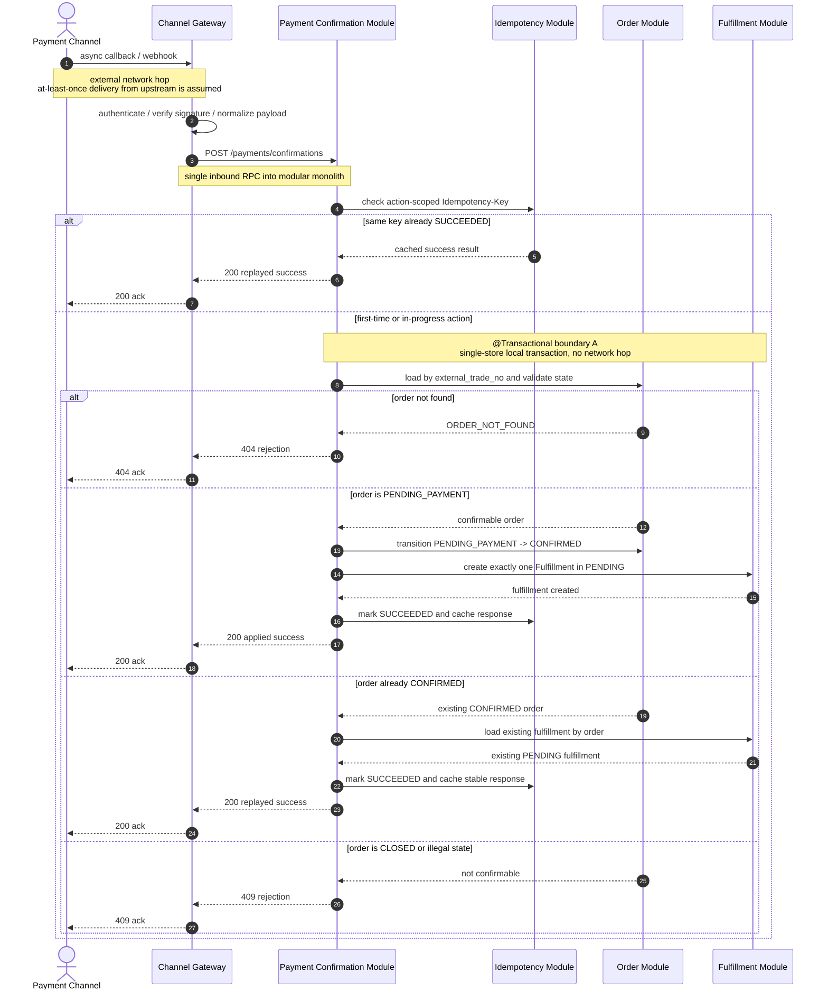
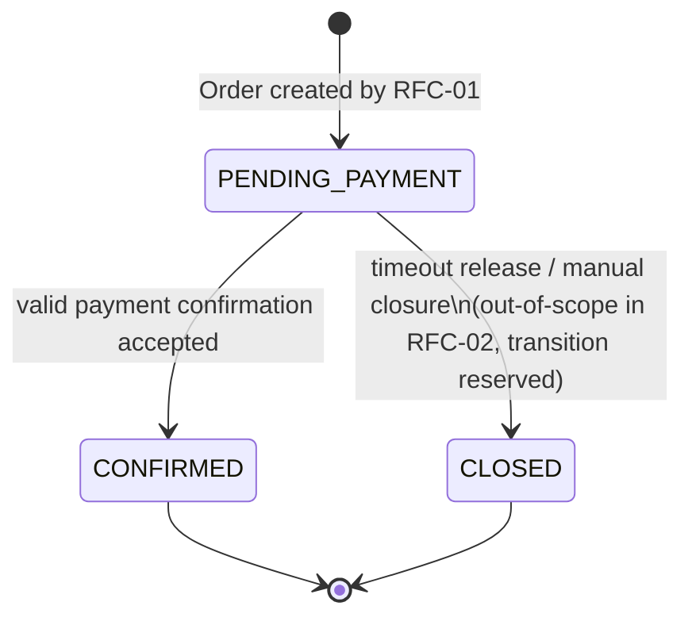
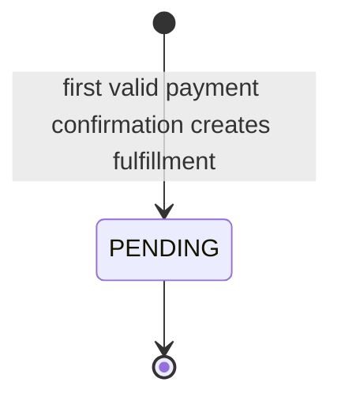
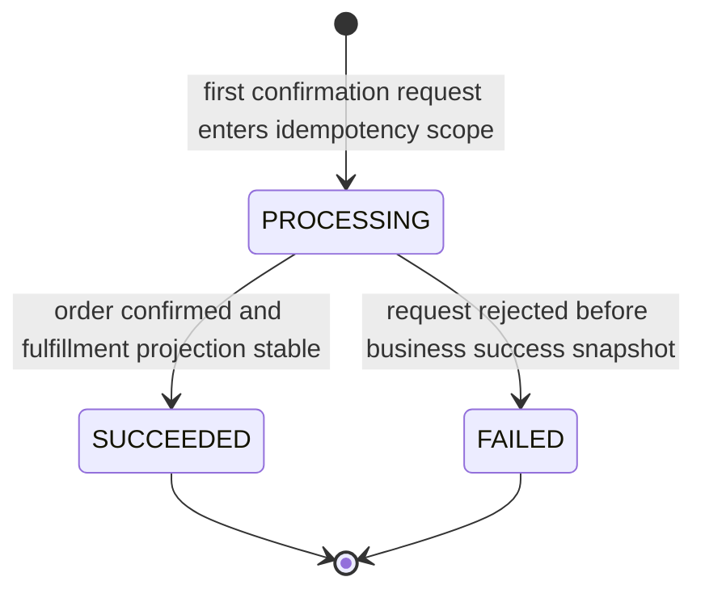

# RFC-TKT001-02: payment-confirmation-and-fulfillment-trigger

## Metadata

* **Epic:** `docs/02_epics/EPIC-TKT-001-core-transaction-backbone.md`
* **Status:** DRAFT / SUCCESS
* **Owner:** qinric
* **Created At:** 2026-04-07

---

## 1. 背景与目标 (Context & Objective)
> **Filled by `requirement-analyst` during REQUIREMENT phase**

* **Summary:** 本次变更聚焦 `EPIC-TKT-001` 的第二个 RFC，目标是在 `Reservation -> Order` 已成立的前提下，把交易主链路继续推进到 `Payment Confirmation -> Fulfillment.PENDING`。该 RFC 负责定义支付确认进入系统后的业务边界：只有有效且处于 `PENDING_PAYMENT` 的 Order 才允许被确认；重复 Payment Confirmation 不得重复推进状态；支付确认成功后只创建一个 `Fulfillment.PENDING`，并明确到此为止仍不展开实际履约执行。

* **Business Value:** 只有把“已创单但未支付”推进到“已确认且已进入待履约”这一步建立稳定约束，`EPIC-TKT-001` 的核心交易骨架才算真正闭环。该 RFC 完成后，系统将具备对真实支付回调/重放场景的最小承接能力，并为后续 RFC-03 的 Timeout Release 与 Audit Trail Hardening 提供稳定起点。

---

## 2. 范围与边界 (Scope & Boundaries)

> **Filled by `requirement-analyst`**

* **✅ In-Scope:**
  * 建立 Payment Confirmation 作为独立业务动作进入系统的边界，语义对齐异步 callback / webhook，而不是平台内同步确认捷径。
  * 明确 Payment Confirmation 只允许作用于仍然有效且处于 `Order.PENDING_PAYMENT` 的订单。
  * 建立 Payment Confirmation 的动作级 Idempotency 目标，确保相同确认事件的重复到达不会重复推进状态或重复创建履约对象。
  * 将满足条件的 Order 从 `PENDING_PAYMENT` 推进到 `CONFIRMED`。
  * 在支付确认成功后创建且只创建一个 `Fulfillment.PENDING`，作为后续履约执行的唯一稳定起点。
  * 明确 Payment Confirmation、Order、Fulfillment 三者之间的业务关系与边界，为后续履约执行和失败恢复提供稳定前提。
  * 明确无效支付确认的拒绝范围，包括订单不存在、订单已关闭、订单已不处于可确认状态等业务场景。

* **❌ Out-of-Scope:**
  * `Fulfillment.PENDING` 之后的实际履约执行、后台推进、重试与终态收敛。
  * 未支付超时关闭、Order 侧定时扫描和 Reservation 联动释放机制。
  * 多渠道鉴权、callback 安全校验细节与复杂协议适配层扩展。
  * Refund、Cancellation、人工纠偏、运营治理和高级补偿编排。
  * 为 Payment Confirmation 或 Fulfillment 引入新的基础设施选型决定，例如 MQ、Outbox、延迟消息等实现策略。
  * Audit Trail 的强化、查询和治理能力补齐；本 RFC 只锁定业务边界，不展开治理深化方案。

---

## 3. 模糊点与抉择矩阵 (Ambiguities & Decision Matrix)

> **Identified by `requirement-analyst`, resolved by human or `system-architect`**
> *If empty -> proceed to design phase*

当前 RFC 无新增模糊点；进入设计阶段时应直接继承以下已确认前提，不再重复争论：

| ID | Ambiguity / Decision Point | Option A | Option B | Final Decision (ADR) |
| :- | :------------------------- | :------- | :------- | :------------------- |
| 1 | Payment Confirmation 的接入语义 | 仅支持平台内同步确认接口 | 按异步 callback / webhook 语义建模 | Inherited from `EPIC-TKT-001`: Option B |
| 2 | Payment Confirmation 的幂等边界 | 仅依赖统一 `external_trade_no` | `external_trade_no` 串联交易，并保留 Payment Confirmation 动作级 `Idempotency Key` | Inherited from `EPIC-TKT-001`: hybrid strategy |
| 3 | 支付确认后的推进终点 | 支付成功后直接进入复杂 Fulfillment Execution | 只推进 `Order.CONFIRMED` 并创建 `Fulfillment.PENDING` | Inherited from `EPIC-TKT-001`: Option B |
| 4 | Payment Confirmation 的可作用订单状态 | 对任意未终止订单都接受确认 | 仅允许 `Order.PENDING_PAYMENT` 被成功确认 | Inherited from `EPIC-TKT-001`: Option B |

---

## 4. 技术实现图纸 (Technical Design)

> **MUST NOT proceed unless Section 3 is fully resolved**

### 4.1 核心状态流转与交互 (Sequence & State)
**Selected Lens:** `Backend/Microservices Lens`

虽然当前系统形态是 `modular monolith`，但本 RFC 的核心问题仍然是异步 Payment callback ingress、交易状态一致性、幂等回放和跨模块责任边界，因此继续采用 `Backend/Microservices Lens`。本节明确以下设计基线：

* `Payment Confirmation` 是一个异步进入系统的业务动作，但其核心状态推进仍在单库、本地事务内完成，不引入 MQ、Outbox 或 Saga。
* 事务边界只覆盖 `Order` 状态确认与 `Fulfillment.PENDING` 创建；外部 callback 传输成功与否不属于事务承诺的一部分。
* `Idempotency-Key` 保护动作级重放；`external_trade_no` 用于跨对象串联交易；对“不同 key 但同一交易号的重复成功确认”仍需返回稳定结果，不能重复创建 Fulfillment。
* 当前缺少正式容量数据，先采用有界假设：稳态 `Payment Confirmation` QPS < 20，峰值重放/重试突发 < 100 req/min，同一 `external_trade_no` 的并发确认视为低频但必须正确处理。
* 安全边界前置在 `Channel Gateway`/adapter：只有已完成基础鉴权、签名校验或白名单校验的 callback 才允许进入本 RFC 的业务事务；本 RFC 不设计多渠道安全协议细节。









#### 4.1.1 Boundary Definition

* `Channel Gateway` 负责 callback transport、安全前置校验、渠道 payload 标准化；不拥有交易状态。
* `Payment Confirmation Module` 负责动作级幂等入口、业务编排和成功/拒绝响应投影；不拥有库存或履约执行状态机。
* `Order Module` 独占 `Order.PENDING_PAYMENT -> CONFIRMED` 的状态所有权，并判定“是否仍可被确认”。
* `Fulfillment Module` 独占 `Fulfillment.PENDING` 的创建与唯一性约束，但本 RFC 不展开后续执行流。

#### 4.1.2 Consistency Strategy

* `Order` 与 `Fulfillment` 当前同处单体内单库写路径，因此采用 `strong consistency + local transaction`，而不是 `eventual consistency + outbox`。
* 不把“支付成功后创建 Fulfillment”拆成异步事件，以避免首期就引入“Order 已 CONFIRMED 但 Fulfillment 丢失”的恢复复杂度。
* 幂等命中顺序为：先按动作级 `Idempotency-Key` 命中；若未命中，再按 `external_trade_no` 检查目标 Order 是否已 `CONFIRMED` 且已有唯一 Fulfillment，若成立则返回稳定成功投影。
* `Fulfillment` 唯一性必须来自业务规则和物理约束双保险，即“一个 Order 只能对应一个活跃的 Fulfillment.PENDING”。

#### 4.1.3 Operability Notes

* 必须记录结构化日志字段：`request_id`、`external_trade_no`、`idempotency_key`、`provider_event_id`、`order_id`、`fulfillment_id`、`decision`。
* 必须暴露最小指标：`payment_confirmation_total{outcome}`, `payment_confirmation_latency_ms`, `payment_confirmation_replay_total`, `payment_confirmation_reject_total{code}`。
* 回滚策略限定为单次本地事务回滚；本 RFC 不接受“先确认 Order，再靠异步补 Fulfillment”的人工修复型主路径。

---

### 4.2 接口契约变更 (API Contracts)
`docs/01_registries/api-catalog.yaml` 已存在 RFC-01 的基础入口。本 RFC 在不修改既有 `Reservation / Order` contract 的前提下，新增 Payment Confirmation 入口，并继续复用统一 `error-response` 风格。

#### 4.2.1 API Surface

| Capability | Method | Path | Purpose |
| :-- | :-- | :-- | :-- |
| Payment confirmation ingress | `POST` | `/payments/confirmations` | 接收异步 callback / webhook 语义的支付确认，并原子推进 `Order.CONFIRMED` 与 `Fulfillment.PENDING` |

#### 4.2.2 Shared Business Rules

* `POST /payments/confirmations` 必须要求 header `Idempotency-Key`，其作用域仅限 Payment Confirmation 动作，不与 `POST /reservations` 或 `POST /orders` 共享。
* request body 必须包含 `external_trade_no`，作为查找 Order 和关联 Fulfillment 的交易主键。
* `provider_event_id` 用于渠道侧事件关联与排障，不单独替代动作级幂等键。
* 若目标 Order 为 `PENDING_PAYMENT`，系统必须在同一本地事务内同时完成 `Order.CONFIRMED` 与 `Fulfillment.PENDING` 创建。
* 若目标 Order 已为 `CONFIRMED` 且已存在唯一 `Fulfillment.PENDING`，系统必须返回稳定成功结果，视为 replay success，而不是再次创建资源。
* 若目标 Order 不存在，返回 `ORDER_NOT_FOUND`；若目标 Order 已 `CLOSED` 或处于其他不可确认状态，返回 `ORDER_NOT_CONFIRMABLE`。
* 本 RFC 不接受“支付确认成功但 Fulfillment 延后异步补建”的 contract 语义。

#### 4.2.3 JSON Contracts

```json
{
  "$id": "payment-confirmation-request",
  "type": "object",
  "required": [
    "external_trade_no",
    "payment_provider",
    "provider_event_id",
    "confirmed_at"
  ],
  "properties": {
    "external_trade_no": { "type": "string", "minLength": 1 },
    "payment_provider": { "type": "string", "minLength": 1 },
    "provider_event_id": { "type": "string", "minLength": 1 },
    "provider_payment_id": { "type": "string" },
    "confirmed_at": { "type": "string", "format": "date-time" },
    "channel_context": {
      "type": "object",
      "additionalProperties": { "type": "string" }
    }
  }
}
```

```json
{
  "$id": "payment-confirmation-response",
  "type": "object",
  "required": [
    "order_id",
    "external_trade_no",
    "order_status",
    "fulfillment_id",
    "fulfillment_status",
    "payment_confirmation_status",
    "confirmed_at"
  ],
  "properties": {
    "order_id": { "type": "string" },
    "external_trade_no": { "type": "string" },
    "order_status": {
      "type": "string",
      "enum": ["CONFIRMED"]
    },
    "fulfillment_id": { "type": "string" },
    "fulfillment_status": {
      "type": "string",
      "enum": ["PENDING"]
    },
    "payment_confirmation_status": {
      "type": "string",
      "enum": ["APPLIED", "REPLAYED"]
    },
    "confirmed_at": { "type": "string", "format": "date-time" }
  }
}
```

#### 4.2.4 Error Contract

```json
{
  "$id": "error-response",
  "type": "object",
  "required": ["code", "message", "request_id"],
  "properties": {
    "code": {
      "type": "string",
      "enum": [
        "ORDER_NOT_FOUND",
        "ORDER_NOT_CONFIRMABLE",
        "PAYMENT_CONFIRMATION_IN_PROGRESS",
        "IDEMPOTENCY_CONFLICT",
        "FULFILLMENT_INVARIANT_BROKEN"
      ]
    },
    "message": { "type": "string" },
    "request_id": { "type": "string" },
    "retryable": { "type": "boolean" }
  }
}
```

**Recommended HTTP mapping**

* `200 OK`: 首次应用成功，或 replay 后返回稳定成功投影。
* `404 Not Found`: `ORDER_NOT_FOUND`
* `409 Conflict`: `ORDER_NOT_CONFIRMABLE`, `IDEMPOTENCY_CONFLICT`, `FULFILLMENT_INVARIANT_BROKEN`
* `409 Conflict` or `429 Too Many Requests`: `PAYMENT_CONFIRMATION_IN_PROGRESS`，取决于实现阶段统一错误映射策略；无论选哪种，都必须标记 `retryable=true`

---

### 4.3 存储资产与数据模型 (Storage & Schema)
> **Filled by `database-engineer` during STORAGE_DESIGN phase**
> **Derived strictly from Sections 4.1 and 4.2**

#### 4.3.1 Schema Registry Check

对 `docs/01_registries/schema-summary.md` 的核对结果如下：

* `ticket_order` 已存在，当前承载 `Reservation -> Order.PENDING_PAYMENT` 主记录，因此本 RFC 采用 `ALTER TABLE` 扩展其状态语义与确认元数据，而不是重建主表。
* `idempotency_record` 已存在，且当前模型已具备 `action_name + idempotency_key` 唯一约束、`request_hash`、`response_payload` 与 `status`，足以继续复用为 `PAYMENT_CONFIRMATION` 动作级幂等存储。
* Registry 中尚不存在 `Fulfillment` 实体，因此需要新增 `fulfillment_record` 表，作为“支付确认成功后只创建一个 `Fulfillment.PENDING`”的物理落点。
* 当前 Registry 未出现专门的 `payment_confirmation` 事件表；结合 Section 2 的边界约束与 Section 4.1 的单事务设计，本 RFC 维持最小存储面，只补充为稳定成功投影和 traceability 必需的字段，不额外引入独立 callback ledger。

#### 4.3.2 Entity Derivation

| Table | Purpose | Key Fields | Derivation Logic |
| :-- | :-- | :-- | :-- |
| `ticket_order` | 承接 `PENDING_PAYMENT -> CONFIRMED` 状态推进，并保存支付确认时间 | `order_id`, `external_trade_no`, `status`, `confirmed_at`, `version` | 来自 Section 4.1 的 Order 状态图与并发确认场景，需要在既有订单主记录上持久化确认终态和并发控制基线 |
| `fulfillment_record` | 保存由首个有效支付确认触发创建的唯一 `Fulfillment.PENDING` | `fulfillment_id`, `order_id`, `status`, `confirmed_at` | 来自 Section 4.1 / 4.2 中“支付确认成功后创建且只创建一个 Fulfillment.PENDING”以及 replay success 必须返回稳定 `fulfillment_id` 的约束 |
| `idempotency_record` | 继续缓存 `PAYMENT_CONFIRMATION` 动作级幂等结果 | `action_name`, `idempotency_key`, `request_hash`, `response_payload` | 来自 Section 4.1 的 `PROCESSING -> SUCCEEDED / FAILED` 状态机；本 RFC 复用既有表，无需新增结构 |

#### 4.3.3 Table Design Details

**1. `ticket_order`**

* `status` 列继续保留字符串型状态，但其语义从 RFC-01 的“当前仅 `PENDING_PAYMENT`”扩展为 `PENDING_PAYMENT / CONFIRMED / CLOSED`，以匹配本 RFC 的确认成功与未来 timeout close 预留转移。
* 新增 `confirmed_at`，用于保存首次有效 Payment Confirmation 的业务确认时间。这样即使后续以不同 `Idempotency-Key` 命中“已 CONFIRMED + 已存在 Fulfillment”路径，系统也能返回稳定的 `confirmed_at` 投影。
* 新增 `version`，作为 `PENDING_PAYMENT -> CONFIRMED` 与后续 `PENDING_PAYMENT -> CLOSED` 并发竞争的物理保护基线，兑现 Section 5.2 对同一交易并发确认场景的约束。
* 不把 `payment_provider`、`provider_event_id` 等渠道追踪字段直接堆叠到 `ticket_order`，避免让订单主表承载 callback 适配细节；订单表只保存交易主状态与确认时间这一稳定业务事实。

**2. `fulfillment_record`**

* `fulfillment_id` 作为 Fulfillment 的业务主键，避免在 RFC 阶段绑定具体序列或数据库自增策略。
* `order_id` 建立唯一约束，物理上落实“一个 Order 只能对应一个 Fulfillment”的底线，防止并发确认产生第二条履约起点记录。
* `status` 当前落地值为 `PENDING`，保留字符串列以兼容后续 RFC 对 Fulfillment Execution / Recovery 的状态扩展。
* `payment_provider`、`provider_event_id`、`provider_payment_id`、`channel_context_json` 保存触发履约的最小渠道上下文，满足 callback traceability，同时不引入独立事件账本。
* `confirmed_at` 落在 `fulfillment_record`，确保 Fulfillment 自身可以直接回放其创建所对应的支付确认时间，不必依赖外部日志。
* 新增 `version` 与统一审计列，为后续 `PENDING` 之后的履约推进预留并发控制与问题追踪基础。

**3. `idempotency_record`**

* 本 RFC 不新增列，而是约定 `action_name = PAYMENT_CONFIRMATION` 进入既有动作级幂等空间。
* `response_payload` 继续缓存成功响应，用于“同一 `Idempotency-Key` 重放直接返回稳定成功结果”。
* 对“不同 key、同一 `external_trade_no`”的 replay success，不依赖新增唯一约束，而是由 `ticket_order` 已确认状态与 `fulfillment_record.order_id` 唯一性共同兜底。

#### 4.3.4 Constraint Strategy

* `ticket_order` 保留既有 `PK(order_id)`、`UK(external_trade_no)`、`UK(reservation_id)`，不新增普通索引。
* `fulfillment_record.fulfillment_id` 作为 `PK`，确保履约实体具备稳定业务标识。
* `fulfillment_record.order_id` 建立唯一约束 `uk_fulfillment_record_order_id`，直接兑现“一单一履约”的物理约束。
* 不对 `provider_event_id` 建立唯一约束，因为 Section 4.2 已明确它只用于渠道事件关联与排障，不替代动作级幂等键；若提前施加唯一性，会把 provider 侧事件模型错误上升为本 RFC 的核心一致性前提。
* 按 DBA 阶段红线，本次 migration 只包含 `PK` 与 `UK`，不预先添加普通查询索引；若实现阶段基于真实查询模式发现需要，再通过后续 RFC / migration 补充。

#### 4.3.5 Mapping Patterns Applied

* **State Consistency Pattern:** 扩展 `ticket_order.status` 语义并新增 `fulfillment_record.status`，直接映射 `Order` 与 `Fulfillment` 状态图。
* **Conflict Resolution Pattern:** 为 `ticket_order` 与 `fulfillment_record` 增加 `version`，支撑支付确认并发与未来履约推进的乐观并发控制。
* **Reliability Pattern:** 复用 `idempotency_record` 承载 `PAYMENT_CONFIRMATION` 的 `PROCESSING / SUCCEEDED / FAILED`，并新增 `confirmed_at` 持久化稳定成功投影。
* **Audit Pattern:** `fulfillment_record` 补齐 `payment_provider`、`provider_event_id`、`provider_payment_id`、`channel_context_json` 以及统一 `created_at / updated_at`，满足最小 traceability 与后续排障需要。

---

## 5. 异常分支与容灾 (Edge Cases & Failure Modes)

> **Derived by `system-architect`, rigorously tested by `qa-agent` and implemented by `implementation-agent`**

### 5.1 Cache/Network Failure

* **Trigger:** 上游 Payment Channel 已发送 callback，但在 `200 OK` 返回前发生网络抖动、连接中断或 Gateway timeout，随后触发相同事件的重复投递。
* **Risk:** 如果系统仅依赖“请求是否完整返回”判断是否成功，可能对同一支付结果重复推进 `Order.CONFIRMED` 或重复创建 Fulfillment。
* **Fallback / Recovery:**
  * 核心确认链路不得依赖 cache；业务正确性只依赖单库事务、动作级幂等和 `external_trade_no` 复核。
  * 若首个请求已成功提交，但响应在网络层丢失，重复 callback 必须命中相同 `Idempotency-Key` 或命中“已 CONFIRMED + 已存在 Fulfillment”路径，并返回稳定 `REPLAYED` 结果。
  * 结构化日志必须能按 `provider_event_id + external_trade_no` 追溯是否已成功落账，避免运维通过猜测重复补发。

### 5.2 Concurrency Conflict

* **Trigger:** 同一个 `external_trade_no` 在极短时间内收到多个并发 Payment Confirmation，请求可能携带相同或不同的 `Idempotency-Key`。
* **Risk:** 若只有 header 级幂等，而没有 Order/Fulfillment 双重状态校验，可能出现双重确认、双写 Fulfillment，或一个请求成功另一个请求把状态误判为非法。
* **Fallback / Recovery:**
  * `Order` 状态迁移与 `Fulfillment.PENDING` 创建必须位于同一事务，且创建 Fulfillment 时需要“一单一履约”的唯一性约束。
  * 并发请求中只允许一个请求真正执行 `PENDING_PAYMENT -> CONFIRMED`；其余请求必须读取到稳定终态后返回 `REPLAYED` 成功，或在事务未决时返回 `PAYMENT_CONFIRMATION_IN_PROGRESS`。
  * QA 必须覆盖“相同交易号、不同幂等键”的并发确认场景，验证不会生成第二个 Fulfillment。

### 5.3 External Dependency Failure

* **Trigger:** `Channel Gateway` 的签名校验依赖、渠道适配器或标准化组件在业务事务开始前不可用，导致 callback 无法被可信地转换为统一 `payment-confirmation-request`。
* **Risk:** 如果在外部依赖异常时仍放行不完整请求进入业务层，可能把未认证、缺字段或伪造的支付事件误当成有效确认。
* **Fallback / Recovery:**
  * 所有外部依赖失败必须发生在事务入口之前，直接返回明确失败，不得写入 `Order` 或 `Fulfillment` 状态。
  * `Payment Confirmation Module` 只接收已经完成基础校验和字段标准化的内部 contract；缺少 `external_trade_no`、`provider_event_id` 或 `confirmed_at` 的请求必须在入口层拒绝。
  * 本 RFC 不把外部依赖恢复设计成自动补偿链；恢复后由渠道按 at-least-once 语义重新投递，再由幂等逻辑吸收重复。
